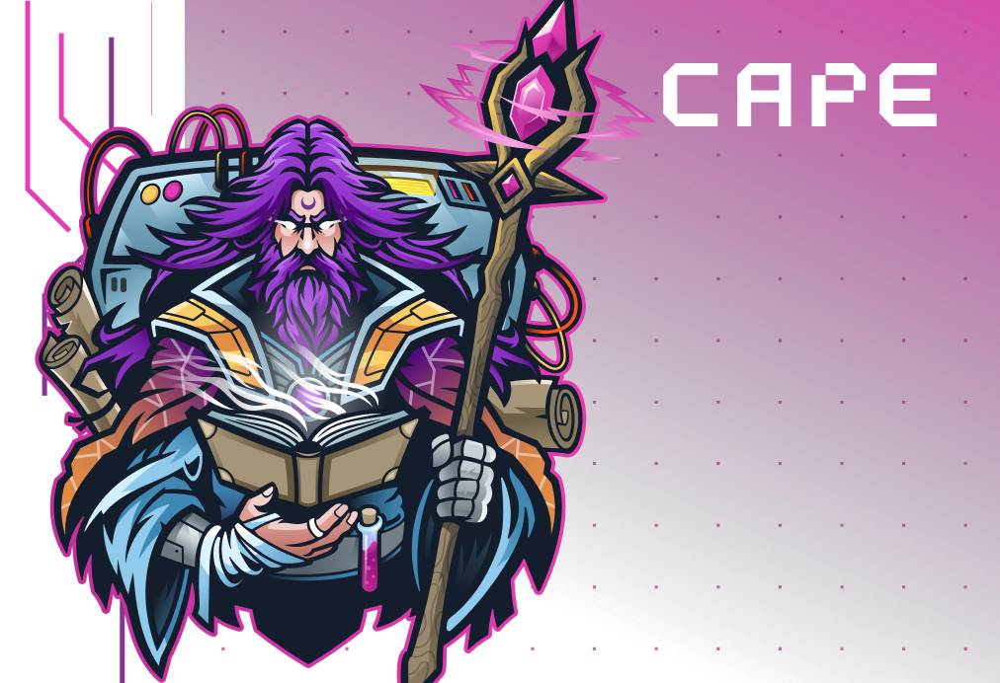
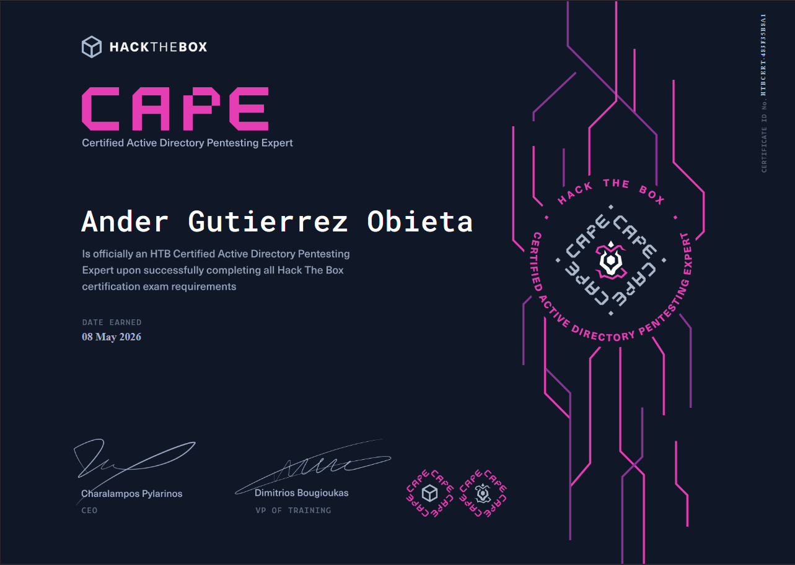

# HTB Certified Active Directory Pentesting Expert (CAPE) – Mi experiencia

`Publicado en mayo de 2026 por PatxaSec`

Los que me conocéis sabéis que llevo bastante tiempo centrado en Active Directory ofensivo, pentesting interno y entornos empresariales. Aunque actualmente estoy preparando el OSCP, en mi trabajo surgió la oportunidad de realizar la formación de HTB Certified Active Directory Pentesting Expert (CAPE) y, para poder acceder a ella, el examen era de obligatorio cumplimiento.

Y sinceramente, no esperaba encontrarme algo tan exigente.

CAPE no es una certificación especialmente conocida ni algo que normalmente busquen recruiters. De hecho, actualmente apenas unas 172 personas la poseemos a nivel mundial y, al menos en mi entorno cercano, no conocía absolutamente a nadie que la tuviera. Pero precisamente por eso creo que tiene tanto valor: porque no está diseñada para ser una checklist de herramientas, sino para obligarte a comprender Active Directory a un nivel muy profundo.

En este artículo quiero contar mi experiencia de la forma más sincera posible. No como un walkthrough técnico, sino como una reflexión sobre lo que supone realmente enfrentarse a CAPE y qué aprendizajes me llevo después de esos 10 días.

---

# TL;DR

* CAPE es probablemente uno de los exámenes de Active Directory más duros y completos que existen actualmente.
* No basta con “tirar herramientas”. Necesitas entender profundamente AD.
* El entorno se siente extremadamente real.
* Los 10 días de examen pasan muchísimo más rápido de lo que parece.
* El desgaste mental termina siendo tan importante como la parte técnica.
* La enumeración constante y la metodología lo son absolutamente todo.
* El reporting es parte fundamental del examen.
* No se pasa solo con conocimientos. También necesitas resiliencia.

---

# CAPE no es un examen “normal”

Creo que la primera gran diferencia respecto a otros laboratorios o certificaciones es que `CAPE` te obliga a cambiar completamente la mentalidad.

Aquí la idea de “ejecuto una herramienta y sigo el caminito” simplemente deja de funcionar.

Muy rápido entiendes que necesitas comprender qué significa realmente cada permiso, cada relación entre objetos, cada delegación y cada pequeño detalle dentro del dominio. Porque muchas veces el examen no te da respuestas claras, te da piezas, y eres tú quien tiene que conectar todo.

Hay momentos donde puedes pasar horas convencido de que no estás avanzando, hasta que descubres que habías ignorado un permiso aparentemente insignificante o una relación que no parecía importante. Y precisamente ahí es donde CAPE empieza a sentirse diferente.

No estás resolviendo máquinas aisladas, estás entendiendo un ecosistema completo.

---

# El entorno se siente increíblemente real

Probablemente una de las cosas que más me impresionó del examen fue lo natural que se siente todo el entorno.

Nada parece artificial. Nada parece diseñado para que encuentres “la vulnerabilidad obvia”. Todo está construido de forma muy coherente, como si estuvieras trabajando realmente dentro de una infraestructura corporativa.

Hay múltiples dominios, relaciones de confianza, segmentación, movimiento lateral, pivoting, permisos mal configurados, delegaciones, evasión de antivirus y cadenas de ataque donde cada pequeño acceso puede acabar convirtiéndose en algo muchísimo más grande.

Y eso hace que el examen sea brutalmente divertido… pero también agotador.

Porque constantemente tienes la sensación de que siempre hay otra capa más profunda que todavía no has visto.

---

# Lo más duro no fue la parte técnica

Aquí viene probablemente la parte más importante de todo el artículo.

Lo más duro de CAPE no fue lo técnico, fue el desgaste mental.

Creo que antes de empezar no era consciente de lo exigente que puede llegar a ser mantener durante tantos días el foco sobre problemas complejos; los días empiezan a mezclarse, pierdes la noción del tiempo, te obsesionas con caminos que no terminan de salir, dudas constantemente de si te has dejado algo atrás... 

Y con perspectiva, cometí errores precisamente por eso.

Hubo momentos donde, por pura cabezonería, pensaba que parar a comer, descansar o dormir era perder tiempo. Seguía delante de la pantalla intentando avanzar cuando mentalmente ya estaba completamente saturado. Y lo peor es que muchas veces rendía peor precisamente por eso. 

Con el tiempo entendí algo importante: a veces avanzar consiste en saber parar.

Muchas soluciones aparecieron después de dormir, salir a despejarme o simplemente dejar de mirar el mismo problema durante unas horas.

CAPE me enseñó que la resiliencia no consiste en aguantar sin parar. Consiste en aprender a sostener el esfuerzo sin romperte por el camino.

Y sinceramente, creo que esa lección vale muchísimo más que cualquier técnica concreta.

---

# La preparación cambia completamente la experiencia

Si algo recomendaría a cualquiera que quiera enfrentarse a CAPE es esto:

No memorices técnicas, Entiende Active Directory.

Porque el examen constantemente te obliga a interpretar relaciones y razonar sobre permisos, contexto y comportamiento. Durante mi preparación intenté repetir laboratorios varias veces, entender por qué funcionaban las cosas y no simplemente seguir walkthroughs. Herramientas como `BloodHound` ayudan muchísimo, pero llega un punto donde necesitas ser capaz de interpretar manualmente lo que estás viendo y validar relaciones por tu cuenta.

También aprendí algo muy importante: la enumeración nunca termina. Nunca.

Cada nueva credencial cambia completamente el escenario. Cada máquina comprometida abre nuevas posibilidades. Cada pequeño detalle puede convertirse en una nueva cadena de ataque. Y cuanto más profundo avanzas, más importante se vuelve mantener una metodología clara.

---

# El reporting es parte del examen

Creo que mucha gente subestima el reporting hasta que se enfrenta realmente al examen. El informe no es un trámite, es parte fundamental de la certificación. Y probablemente uno de los mejores consejos que puedo dar es empezar a escribirlo desde el primer día. No cuando tengas más flags, no cuando “acabes una parte”.

Desde el principio.

Porque documentar consume muchísimo más tiempo y energía mental de lo que parece. Y cuando llevas varios días durmiendo poco y con la cabeza completamente saturada, organizar findings, evidencias y cadenas de explotación se vuelve mucho más duro de lo que imaginas.

Además, escribir el informe también ayuda muchísimo a pensar mejor. Más de una vez encontré detalles importantes mientras documentaba cosas que ya había hecho horas antes, y de haberlas documentado directamente en el informe, habría ganado un tiempo muy valioso.

---

# Qué me llevo realmente de CAPE

Más allá de la certificación, creo que CAPE me ha dejado algo muchísimo más importante: confianza.

Confianza en mi capacidad para enfrentarme a problemas complejos durante días, adaptarme cuando algo no funciona y seguir avanzando incluso cuando mentalmente estaba agotado.

También me llevo humildad.

Porque por mucho que creas que sabes sobre Active Directory, siempre descubres otra capa más profunda que todavía no entiendes del todo. Y quizá eso es precisamente lo que hace tan especial este examen. Que no sales pensando: “sé usar más herramientas”. Sales entendiendo mejor cómo funciona realmente Active Directory. 

Pero sobre todo, sales entendiéndote mejor a ti mismo bajo presión. Y sinceramente, creo que esa es la verdadera certificación.

Ahora toca seguir aprendiendo… y continuar el camino hacia el OSCP.

