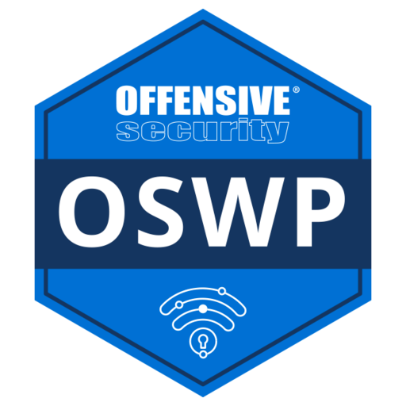
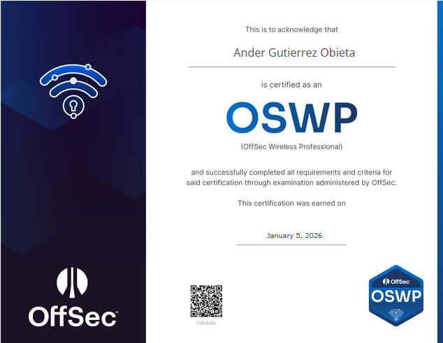

# OSWP (OffSec Wireless Professional) – Mi experiencia y opinión

`Publicado en mayo de 2026 por PatxaSec`

## Introducción

Hace un tiempo decidí presentarme a la OSWP (OffSec Wireless Professional), una certificación centrada en auditoría y explotación de redes inalámbricas. Realmente no era una certificación que tuviera especialmente en mente hacer, pero venía incluida dentro del plan Learn One de OffSec junto con el OSCP, así que decidí aprovecharla como primera toma de contacto con el formato de exámenes prácticos de OffSec.

Y sinceramente, creo que fue una buena forma de empezar.

Aunque actualmente estoy mucho más enfocado en Active Directory ofensivo y entornos empresariales, la OSWP me sirvió para familiarizarme con la metodología de OffSec, acostumbrarme a trabajar bajo tiempo limitado y ganar confianza antes de enfrentarme a certificaciones bastante más complejas.

---

# Qué esperar del curso

El contenido de PEN-210 está bastante enfocado a entender cómo funcionan las redes inalámbricas a bajo nivel. No es simplemente un “usa esta herramienta y rompe un Wi-Fi”, sino que dedica bastante tiempo a explicar estándares 802.11, tipos de tramas, handshakes, roaming, autenticación y análisis de tráfico.

En algunos momentos incluso recuerda bastante a una asignatura de networking.

También se trabaja bastante con Wireshark y filtros para analizar paquetes capturados, algo que personalmente me gustó bastante porque ayuda a entender mejor qué está ocurriendo realmente detrás de cada ataque.

Obviamente, también cubre ataques clásicos contra WPA/WPA2, captura de handshakes, rogue APs, ataques contra redes enterprise y distintos métodos de autenticación inalámbrica.

---

# Los laboratorios

Probablemente esta sea la parte más floja de la certificación.

OSWP prácticamente no tiene laboratorios reales donde practicar los ataques del curso. La mayor parte de la práctica se basa en PCAPs y análisis con Wireshark, lo cual personalmente creo que se queda bastante corto para preparar un examen práctico.

En mi caso, lo que más me ayudó fue complementar toda la preparación con WiFiChallenge Lab. Ahí sí puedes practicar ataques reales sobre distintos escenarios inalámbricos, repetir técnicas y acostumbrarte a resolver problemas de forma mucho más dinámica.

Y sinceramente, creo que fue la clave para llegar cómodo al examen.

---

# El examen

El examen de OSWP es probablemente uno de los más directos y asequibles de OffSec. Dispones de 3 horas y 45 minutos para comprometer varias redes inalámbricas y recuperar sus respectivas flags, además de documentar correctamente el proceso para el informe.

El laboratorio de examen está compuesto por 3 redes distintas y, para aprobar, necesitas comprometer al menos 2 de ellas y obtener el correspondiente `proof.txt`. Sin embargo, hay un pequeño detalle importante: una de las redes es obligatoria. Eso significa que puedes comprometer 2 de las 3 y aun así suspender si precisamente la que no has conseguido resolver era la obligatoria.

Además, el reporting también forma parte del examen. No basta únicamente con obtener acceso; necesitas documentar correctamente todo el proceso y adjuntar las capturas necesarias. Como mínimo, OffSec exige evidencias del `proof.txt` y de las credenciales obtenidas para cada red comprometida.

Durante el examen tampoco está permitido utilizar herramientas que automaticen completamente la explotación —como Wifite o Wiphisher— ni herramientas de inteligencia artificial. Pero sinceramente, tampoco hacen falta si llegas bien preparado.

Una vez terminadas las 3h 45mins del laboratorio, dispones de 24 horas para terminar y enviar el informe.

En mi caso, la experiencia fue muchísimo más fluida de lo que esperaba.

La preparación previa usando WiFiChallenge Lab me ayudó muchísimo. Llegué al examen teniendo muy claros los pasos, qué ataques utilizar en cada escenario y cómo enfrentar cada tipo de red. Aunque empecé algo nervioso —como supongo que le pasa a cualquiera en su primera certificación—, en cuanto empecé a resolver el primer escenario me di cuenta de que todo encajaba bastante bien.

Todo fue muy natural.

No tuve que improvisar prácticamente nada y todos los escenarios salieron a la primera siguiendo exactamente la metodología que había practicado anteriormente.

Al final conseguí completar la explotación de las 3 redes dentro del tiempo del laboratorio y además avancé parte del informe antes incluso de terminar el examen. En menos de 5 horas tenía tanto el examen como el reporte completamente finalizados y enviados.

Y sinceramente, creo que esa sensación fue lo más positivo de toda la experiencia.

No tanto “aprobar”, sino comprobar que la preparación había funcionado exactamente como esperaba y que podía enfrentarme a un examen práctico de OffSec de forma tranquila, ordenada y sin improvisar constantemente.

---

# Mi opinión sobre OSWP

Sinceramente, creo que OSWP es probablemente la certificación más accesible de OffSec. Muchas de las técnicas que aparecen están extremadamente documentadas en Internet y no requiere una profundidad técnica especialmente alta comparada con otras certificaciones ofensivas.

Personalmente, no creo que sea una certificación especialmente diferencial a nivel técnico ni algo que aporte demasiado valor profesional por sí sola hoy en día.

Aun así, no me arrepiento de haberla hecho.

Como primera experiencia con OffSec me sirvió para ganar soltura, acostumbrarme al formato de examen práctico y empezar a desarrollar metodología antes de enfrentarme a retos mucho más complejos como CAPE u OSCP.

¿La recomendaría?

Probablemente solo si ya viene incluida dentro de algún plan de formación como Learn One o si quieres una primera toma de contacto más llevadera con el estilo de certificaciones prácticas de OffSec.

