As is common in real life pentests, you will start the Outbound box with credentials for the following account `tyler` / `LhKL1o9Nm3X2`

---

# Enumeración inicial


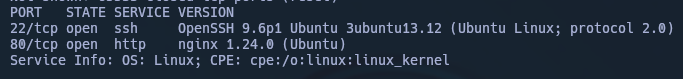

-> `/etc/hosts`

```
10.10.11.77    outbound.htb mail.outbound.htb
```


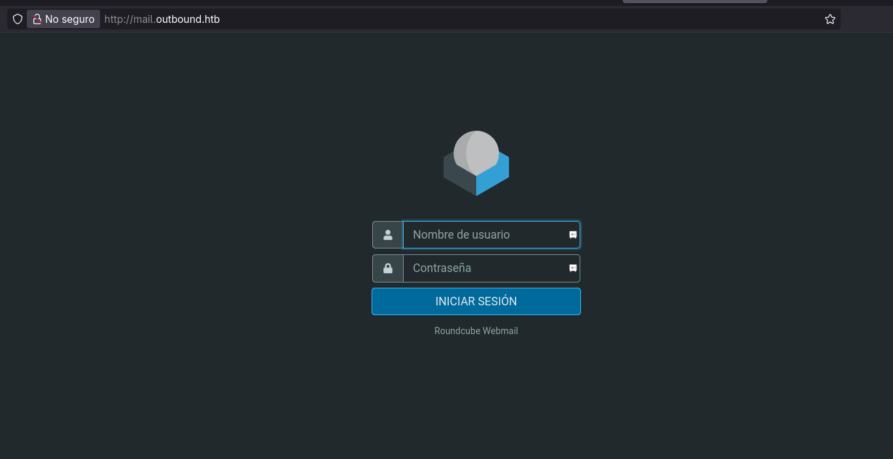

# Acceso

Utilizamos el exploit de [CVE-2025-49113](https://github.com/hakaioffsec/CVE-2025-49113-exploit) para conseguir acceso como `www-data` mediante una reverse-shell.

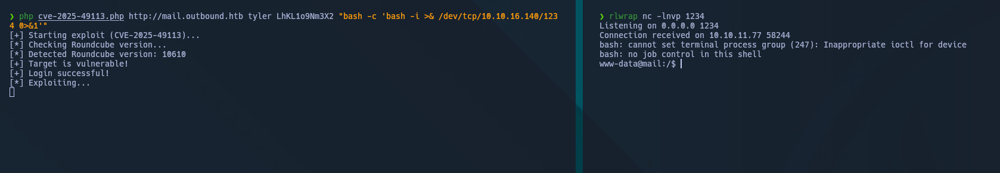

Investigando en el servidor encontramos scripts interesantes:

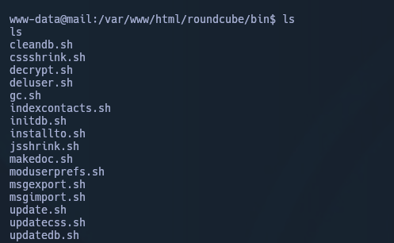

Investigando un poco mas a fondo encontramos credenciales de acceso a un servicio `mysql` local. 

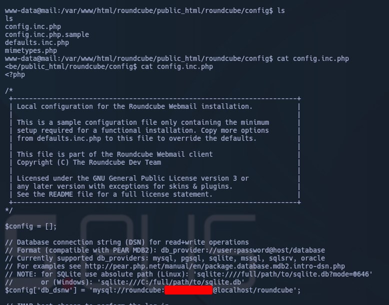

Nos conectamos al serrvicio `mysql`.

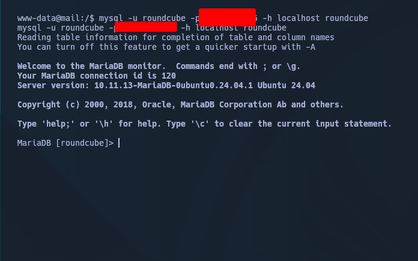

Enumeramos las tablas disponibles:

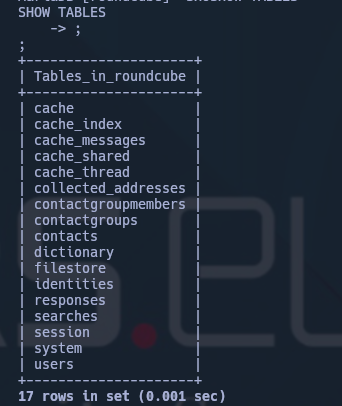

Encontramos datos cifrados en `base64` dentro de la tabla `session`.

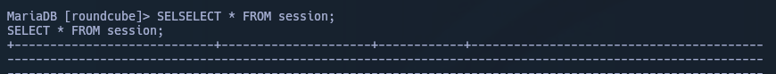

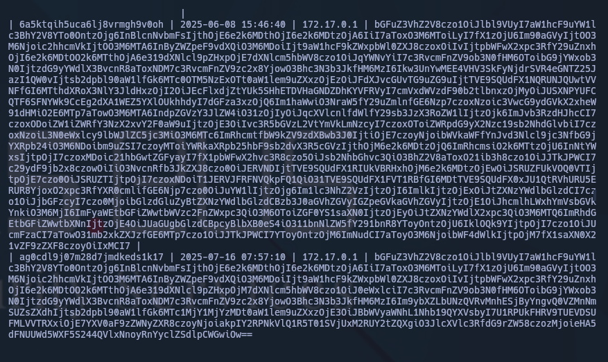

En base a prueba y error, encontramos lo que parece un hash para acceder al servicio de mail con el usuario `jacob`.

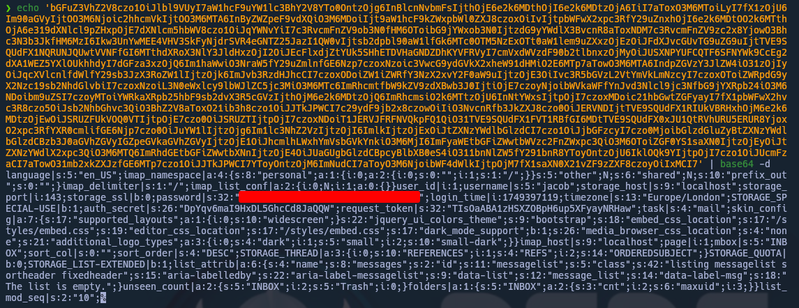

Crackeamos el hash encontrado mediante el uso del script `decript.sh` encontrado previamente en `/var/www/html/roundcube/bin/`

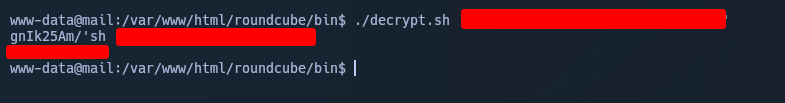

Accedemos al servicio de roundcube usando la credencial, y podemos ver un correo en el que leemos en texto plano la credencial ssh del usuario.

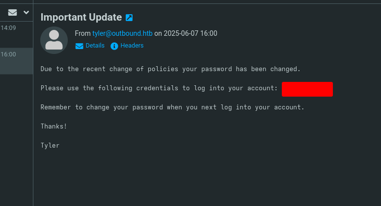

Nos logueamos por ssh:

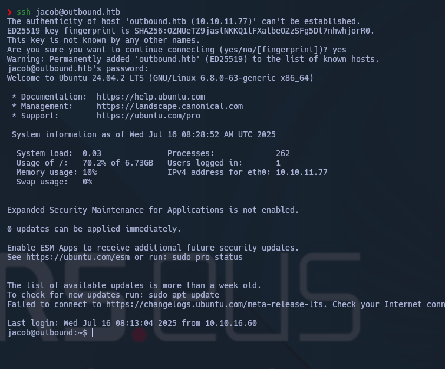

Conseguimos el `user.txt`


# Movimiento lateral y Escalada


Vemos qué comandos puede ejecutar `jacob` con `sudo` sin contraseña.

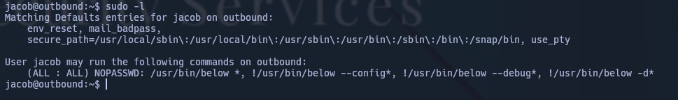
Vemos que el usuario `jacob` puede ejecutar `/usr/bin/below` como **cualquier usuario** sin necesidad de contraseña. Mediante **cualquier argumento**, excepto los que empiecen con `--config`, `--debug`, o `-d`.

Podemos aprovecharnos de esto con el siguiente [CVE-2025-27591](https://github.com/BridgerAlderson/CVE-2025-27591-PoC/blob/main/exploit.py):

- **Crea un symlink**:  
    Apunta `/var/log/below/error_root.log` → `/etc/passwd`.
- **Ejecuta** `sudo /usr/bin/below record`, que:
    - Es ejecutado como `root` sin contraseña (según la configuración de `sudo -l`).
    - Intenta escribir logs en `/var/log/below/error_root.log`, que **apunta a `/etc/passwd`**.
- Como resultado, **`below` intenta escribir como root en `/etc/passwd`**.
- Luego, el script **abre `/etc/passwd` (a través del symlink)** y le hace `f.write(...)`, lo que:
    - Añade una línea de usuario malicioso (`attacker::0:0:...`).
    - Y altera los permisos de `/etc/passwd` al haber truncado o reescrito el archivo.

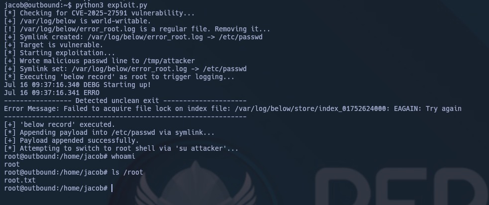

`HAPPY HACKING`


