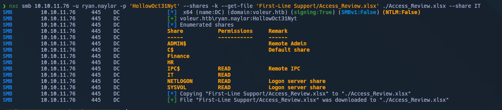
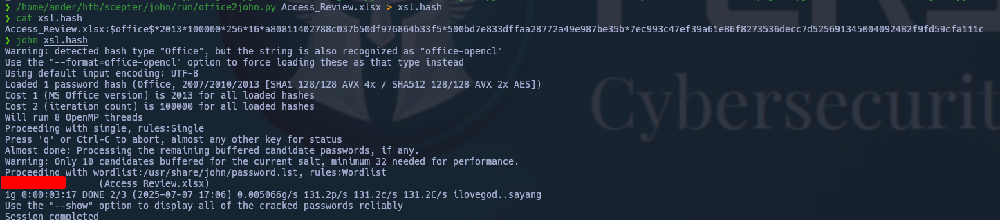
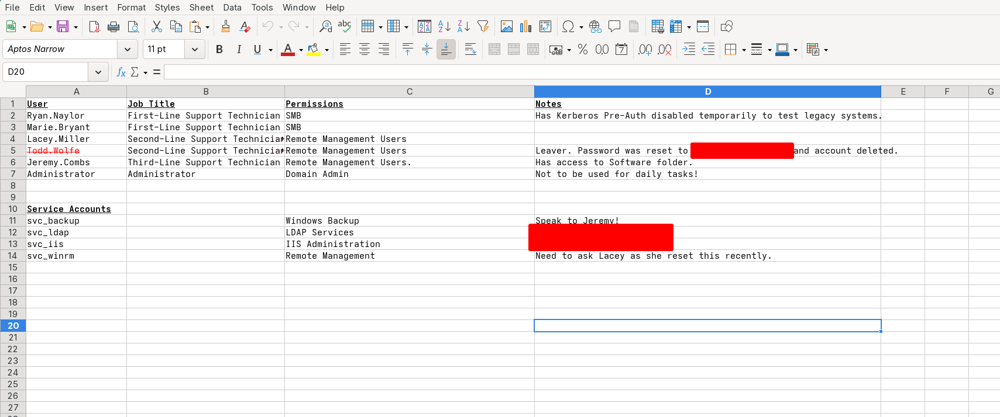
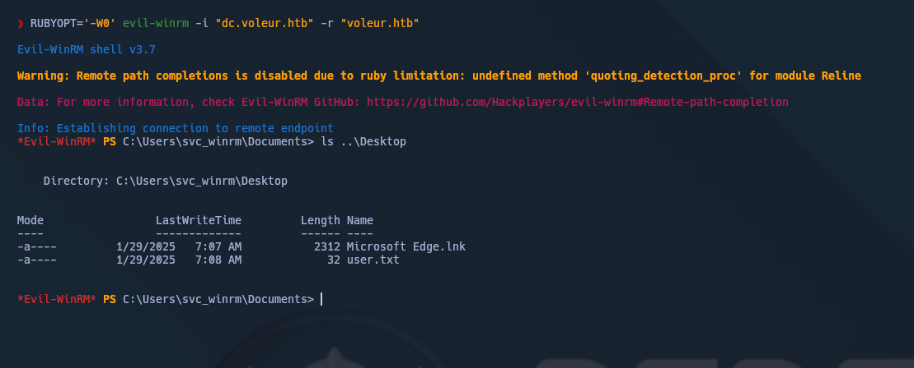
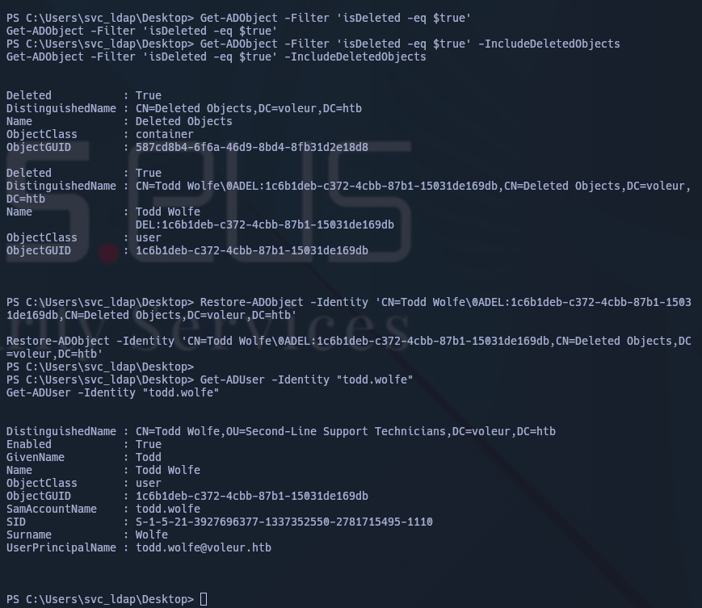
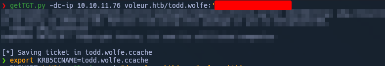
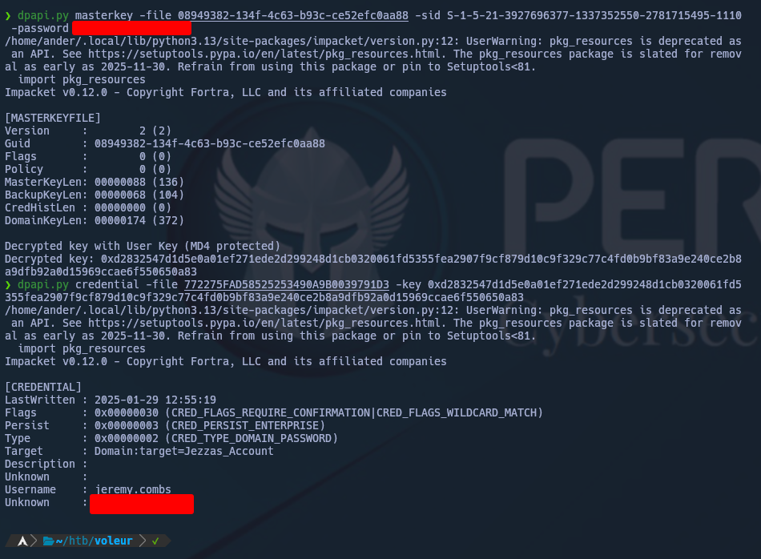
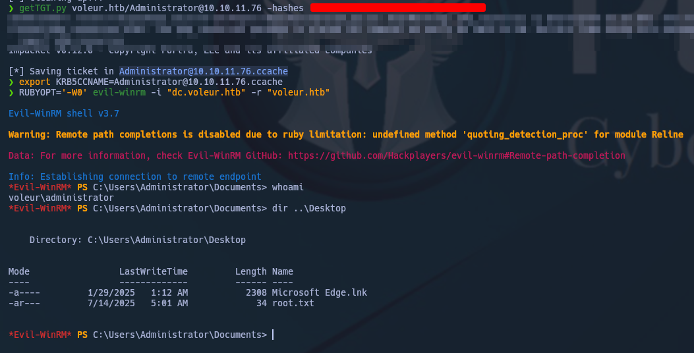
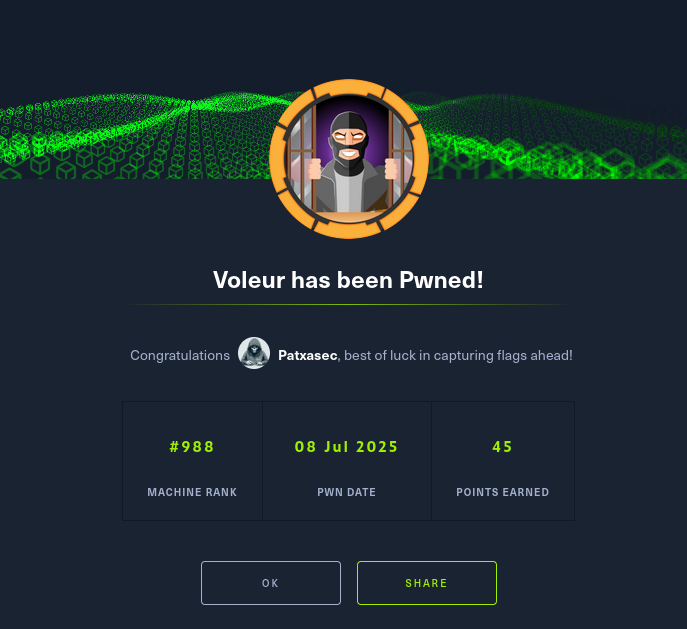

---

As is common in real life Windows pentests, you will start the Voleur box with credentials for the following account: `ryan.naylor` / `HollowOct31Nyt`

---

# Enumeración Inicial

Enumerando los `SHARE`s encontramos un archivo interesante:

Nos descargamos el `Access_Review.xlsx` y crackeamos su credencial de lectura con `john`.

Dentro del archivo, podemos observar las credenciales de barios usuarios.

Aprovechamos las credenciales de `svc_ldap` para ejecutar `BloodHound` y poseer una visión global.

# Acceso

Como `svc_ldap` ejecutamos `targetedKerberoast` para conseguir las credenciales de `svc_winrm`.

Conseguimos la `user.txt`

# Movimiento lateral y Escalada

Aprovechando las credenciales de `svc_ldap` restauramos al usuario `todd.wolfe`

Como usuario `todd.wolfe`  nos conectamos por `smbclient` a `Second-Line` y con el objetivo de abusar de [DPAPI](https://www.thehacker.recipes/ad/movement/credentials/dumping/dpapi-protected-secrets#practice) nos descargamos `credential` y `masterkey`

Realizamos el abuso para crackear y conseguir las credenciales de `jeremy.cobs`  

Como `jeremy.combs` nos conectamos a `Third-Line` y nos descargamos el `id_rsa`, que pertenece a `svc_backup`.

Como usuario `svc_backup` usamos el `id_rsa` para descargar los registries de `/mnt/c/IT/Third-Line Support/Backups`, y ejecutamos `secretsdump`.

Ahora somos Administradores!

HAPPY HACKING

---

